## Cloud Formation
- CloudFormation is an Infrastructure as Code (IaC) product in AWS which allows automation infrastructure creation, update and deletion.
- Templates created in YAML or JSON can be used to automate infrastructure operations
- Templates are used to create stacks, which are used to interact with resources in an AWS account.
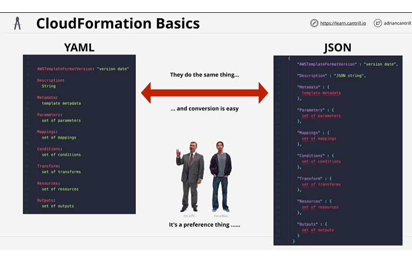
- All Template has a list of **resources**(only **mandatory** part of template) , resources section tells the cloud formation what needs to be done(out of CRUD operations).
- **Description** - non mandatory, however if used must follow the AWSTemplateFormatVersion
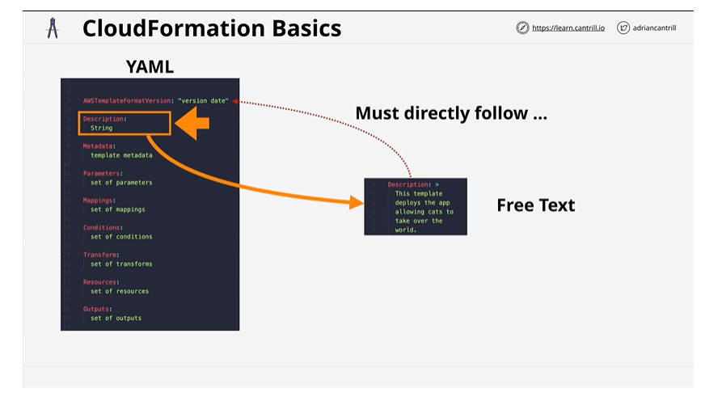
- **Metadata** - Controls the UI
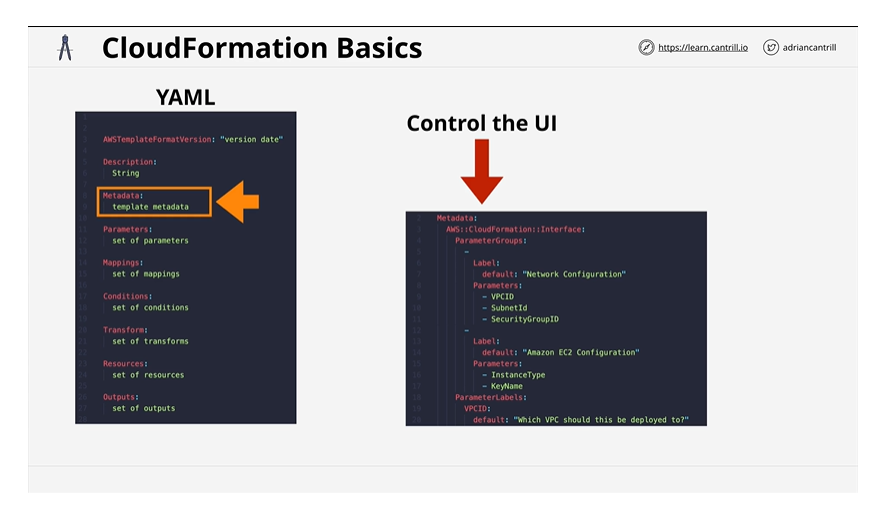
- **Parameters** - Options provided from the UI
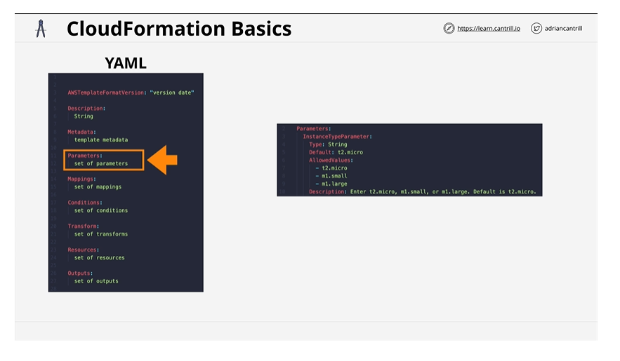
- **Mappings** - Allows to create lookup table
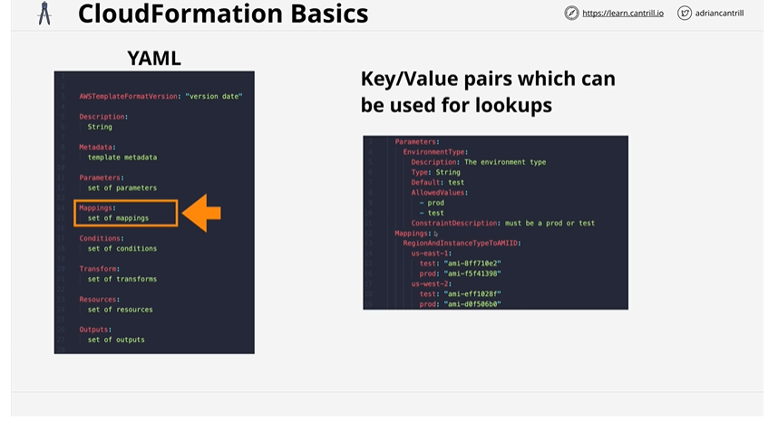
- **Conditions** - Used to create conditions , below creates EC2 instance only when CreateProdResources is true
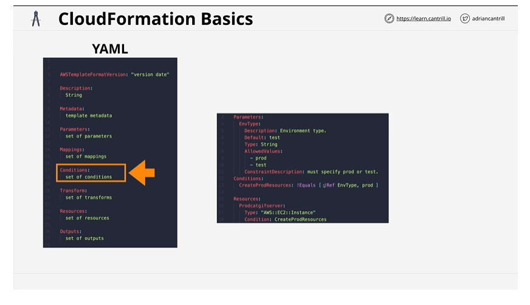
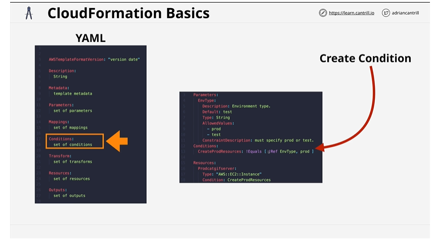
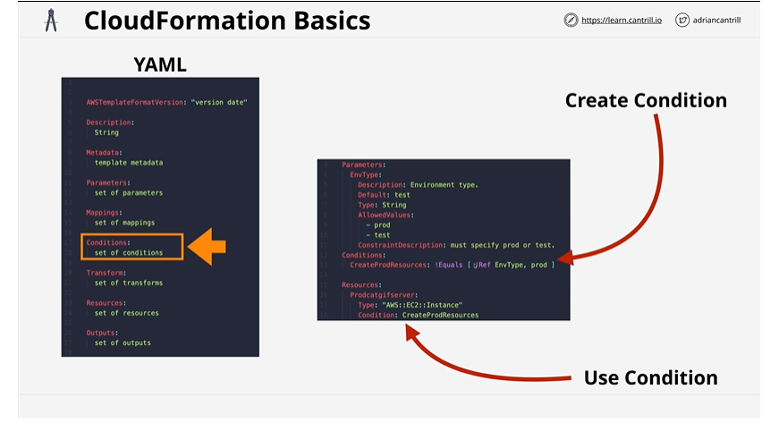

- **Outputs** - 
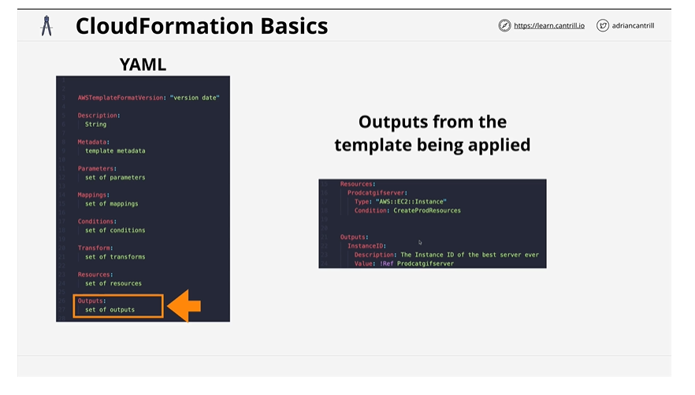

### Template to create EC2 instance :

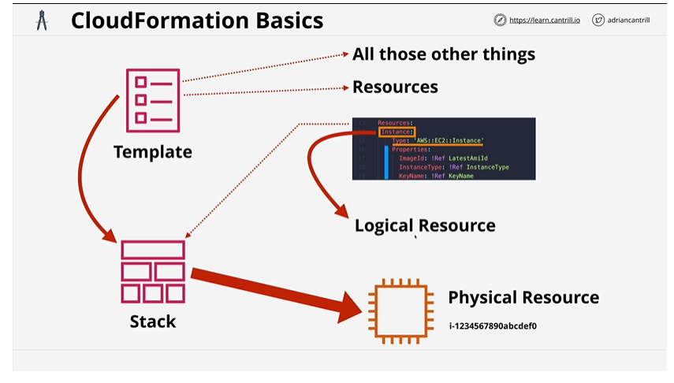
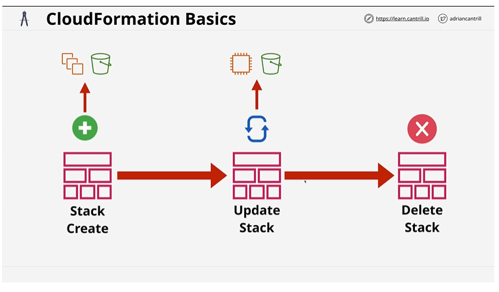

### YAML
- ***YAML*** is one of the languages, that Cloud uses as a template.
    - human readable 
    - define data 
    - configuration 
    - Key:Value pair 
      - supports:
        - string, integer, boolean, float, null 
    - Lists cats : ["a","b","c"] 
      - or cats:
        - "a"
        - "b"
        - "c"
    - dictionary 
      - turtle:
         - name: "Pixel"
         - color: ["green", "grey"]
         - name: "Sid"
         - color: ["black", "green"]
    - indentation matters

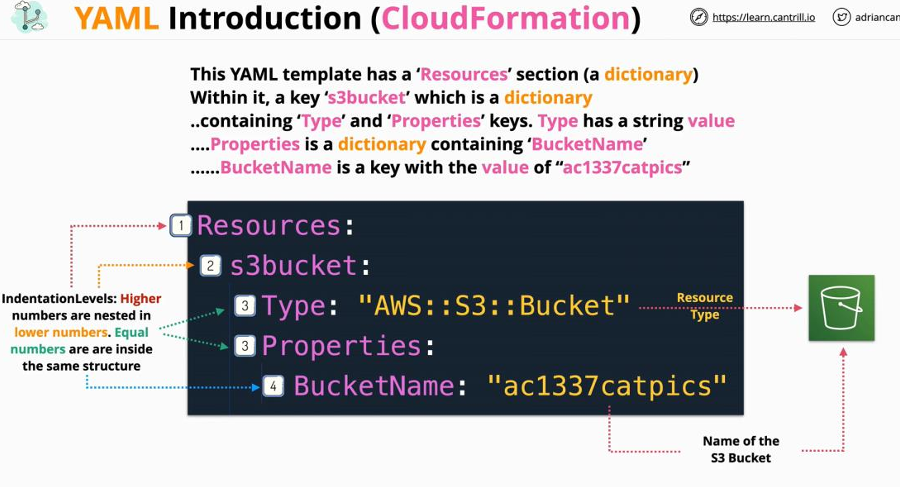

### JSON
- JavaScript Json Notation (JSON) -used broadly
- used for data-interchange format
- easy for humans to read and write
- easy for machines to parse and generate
- does not care about indentation -has brackets
- JSON object is an unordered set of key:value pairs enclosed by curly brackets {} -dictionary
- JSON array is an ordered collection of values, separated by commas and enclosed in square brackets [] -list
- Values can be: string, object, integer, array, boolean, null
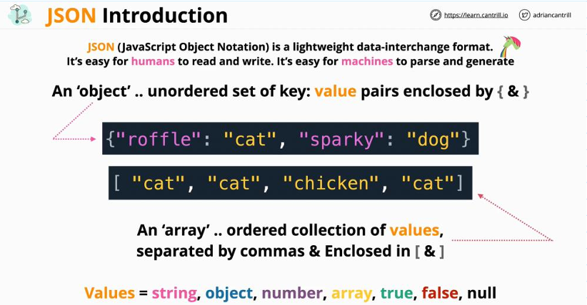
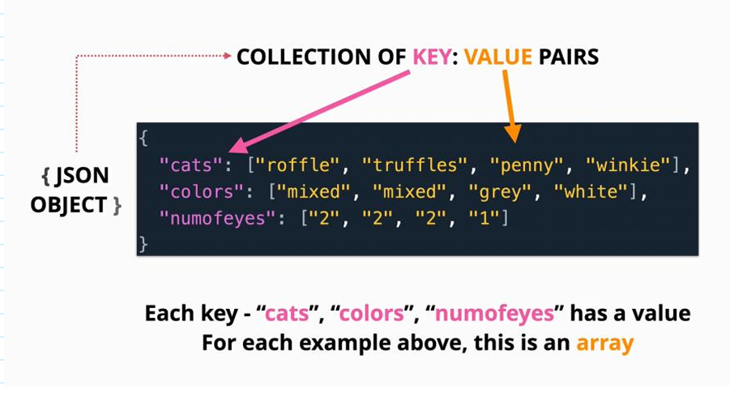
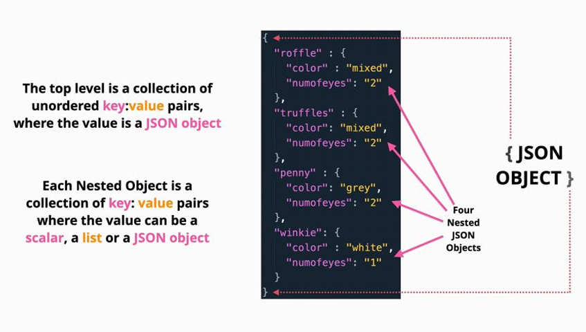
