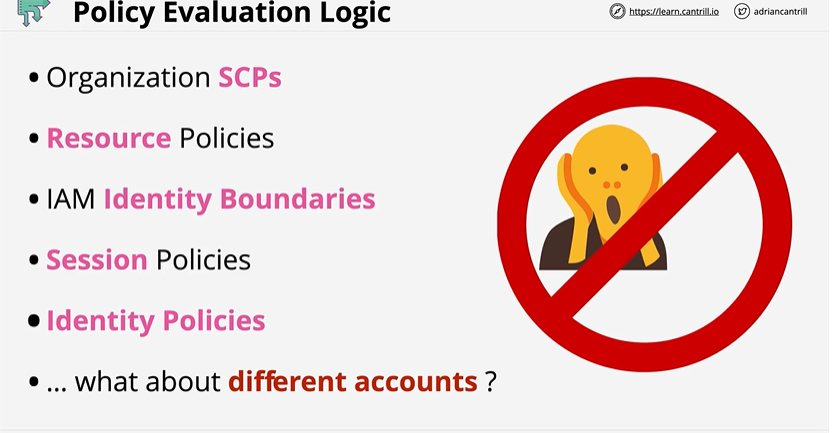
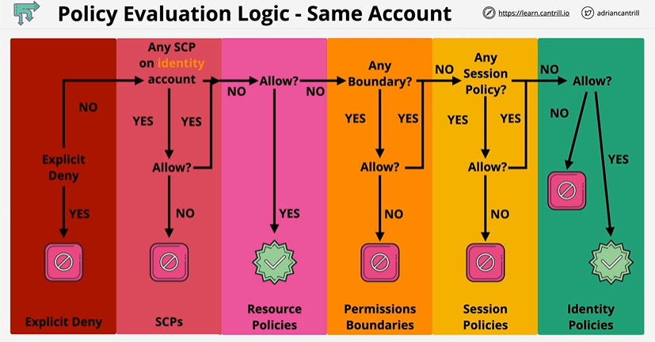
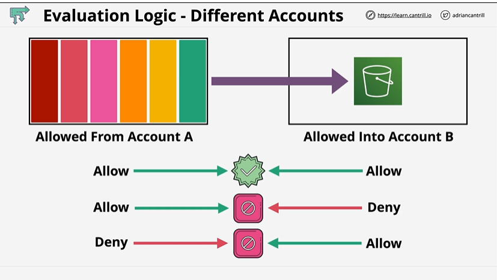

# AWS Permission Evaluation

## Overview
This lesson steps through the policy evaluation process which AWS uses for single and multi-account access scenarios. The same process is used each and every time an identity attempts to access a resource.

## Policy Evaluation Logic


## What Policies Can Affect a Request?
When you call an AWS API (e.g., s3:GetObject), AWS may look at several policy types:
- SCPs (Service Control Policies) – from AWS Organizations, applied to accounts/OUs
- Resource-based policies – e.g. S3 bucket policy, KMS key policy, SQS queue policy
- Permissions boundaries – limits how much an IAM role/user can be allowed
- Session policies – passed when you assume a role / federate (STS)
- IAM Identity-based policies – attached to user, group, or role

Other service-specific controls – e.g. S3 Block Public Access, VPC endpoint policies, KMS key policy conditions, etc.

### Same Account


# ✅ **AWS Policy Evaluation Logic — Same Account (Notes)**

AWS evaluates IAM permissions through a strict ordered process.
A request is **Allowed** only if *every layer* permits it and **no explicit deny** matches.

---

# 1️⃣ **Explicit Deny (Always Checked First)**

* AWS first checks if **any policy** (identity, resource, SCP, boundary, session) contains:

  ```
  "Effect": "Deny"
  ```
* If a matching Explicit Deny is found → **Request immediately DENIED**.
* Nothing can override an explicit deny.

---

# 2️⃣ **Service Control Policies (SCPs)**

* SCPs apply **at the AWS Organization/OU/account level**.
* SCPs **do NOT grant permissions**, they only **set the maximum allowed permissions** in the account.
* Flow:

    * If the identity’s account is under an SCP…

        * If SCP *explicitly allows* the action → move forward
        * If SCP does **not allow** or denies → **DENIED**
* If no SCP exists → move to resource policies.

---

# 3️⃣ **Resource Policies**

* Examples: S3 Bucket Policy, KMS Key Policy, SQS Policy, VPC Endpoint Policy.
* These policies define: **Who can access the resource**.
* Flow:

    * If the resource policy explicitly **allows** the action → continue
    * If not allowed → request **DENIED** (unless identity policies will allow later)
    * If resource policy **denies** → immediate **DENY**

Resource policies are especially critical for **cross-account access**.

---

# 4️⃣ **Permissions Boundaries**

* Applied to **IAM users or roles** to limit maximum permissions.
* They do not grant access; they restrict it.
* Flow:

    * If a boundary exists → IAM checks if boundary **allows** the action
    * If boundary does not allow → **DENIED**
    * If boundary allows → continue
* If no boundary → skip this step.

---

# 5️⃣ **Session Policies** (STS AssumeRole / Federated Access)

* Applied when:

    * Using **AssumeRole**
    * Using **Federation / Web Identity Tokens**
* They act as an additional **restrictive filter**.
* Flow:

    * If a session policy exists → check if it allows
    * If session policy denies or doesn’t allow → **DENIED**
* If no session policy → continue.

---

# 6️⃣ **Identity-Based Policies (IAM Policies)**

* Attached to: **Users, Groups, Roles**
* These are the *actual granting* of permission.
* Flow:

    * If identity policies contain a matching **Allow** → **ALLOWED**
    * If they do not → **Implicit Deny**

Identity policies are checked *last*, but are essential because only they can *grant* access.

---
### Different Account


# 1️⃣ **Step 1: Evaluation in Account A (Caller Account)**

Account A = The account **where the identity lives**
(e.g., IAM user, IAM role, Lambda execution role)

AWS checks:

### ✔ Identity-based policies

(users, roles, groups)

### ✔ Permissions boundaries

(if attached)

### ✔ Session policies

(when assuming a role)

### ✔ SCPs of the caller’s account

### ✔ Explicit deny

(from any of the above)

### ❗ Resource policies inside Account B are **NOT** checked at this stage.

### **Result:**

Account A must produce a **final Allow**.
If Account A produces Deny → request **never reaches Account B**.

---

# 2️⃣ **Step 2: Evaluation in Account B (Resource Account)**

Account B = The account **where the resource exists**
(e.g., S3 bucket, KMS key, SQS queue, SNS topic)

AWS checks:

### ✔ Resource-based policy (bucket policy, key policy, queue policy, etc.)

### ✔ SCPs on Account B

(affect the resource’s account)

### ✔ Service-level restrictions

– S3 Block Public Access
– VPC endpoint policy
– KMS key policy
– Service-specific conditions

### ✔ Explicit deny

(from resource policy or SCP)

### ❗ Identity policies in Account A do **NOT** matter here anymore.

### **Result:**

Account B must also produce **Allow**.
If Account B denies → final result = **DENY**.

---

# 🚦 Summary: **Two-Stage Evaluation**

To access a resource in another account:

```
Account A: Caller must ALLOW
AND
Account B: Resource must ALLOW
```

Both sides must independently allow → **Cross-account Allow**
If either side denies → **Denied**

This feature is unique to cross-account access.

---

# 🧠 Visual Summary (Matching the Diagram)

### Case 1 — **Allow → Allow → Allowed**

* Account A identity allows
* Account B resource policy allows
  ✔ Final: **ALLOWED**

---

### Case 2 — **Allow → Deny → Denied**

* Account A allows
* Account B explicitly denies
  ✘ Final: **DENIED**
  (Resource policies can override caller permissions.)

---

### Case 3 — **Deny → Allow → Denied**

* Account A denies
* Account B allows

✘ Final: **DENIED**
(Call never makes it to Account B.)

---

# 📝 Key Exam Points (DVA-C02)

### ✅ 1. **Both accounts must separately allow.**

Identity policy alone is not enough.

### ✅ 2. **Resource policies in Account B must explicitly allow the principal from Account A.**

Example (S3 bucket policy):

```json
{
  "Effect": "Allow",
  "Principal": {"AWS": "arn:aws:iam::111111111111:role/AppRole"},
  "Action": "s3:PutObject",
  "Resource": "arn:aws:s3:::my-bucket/*"
}
```

### ✅ 3. **Explicit Deny in either account always wins.**

### ✅ 4. **Identity policies in Account A cannot grant access to resources in Account B.**

They only authorize the caller.

### ✅ 5. **SCPs in BOTH accounts apply.**

---

# **Q1. SCP + Identity Policy Conflict**

Your AWS account is part of an Organization. An IAM role in the account has the following identity policy:

```json
{
  "Effect": "Allow",
  "Action": "ec2:StartInstances",
  "Resource": "*"
}
```

However, the account’s SCP contains:

```json
{
  "Effect": "Deny",
  "Action": "ec2:*",
  "Resource": "*"
}
```

A Lambda function assumes the role and tries to start an EC2 instance.

**What is the outcome?**

A. Allowed
B. Denied because of the identity policy
C. Denied due to the SCP
D. Allowed only if Lambda has a VPC attached

### **Correct Answer: C**

### **Explanation:**

SCPs set the *maximum permissions* for the account.
The SCP explicitly denies all EC2 actions → **no policy can override it**, including IAM role policies.

---

# **Q2. Resource Policy Required? S3 Access**

A developer’s IAM user has this identity policy:

```json
{
  "Effect": "Allow",
  "Action": "s3:GetObject",
  "Resource": "arn:aws:s3:::my-app-data/*"
}
```

The S3 bucket has **no bucket policy**.

The user tries to download an object.

**What is the outcome?**

A. Allowed
B. Denied because S3 bucket policy is missing
C. Allowed only if Block Public Access is off
D. Denied unless the user is in the same region as the bucket

### **Correct Answer: A**

### **Explanation:**

For **same-account access**, S3 **resource policies are optional**.
Identity policy alone is enough unless:

* blocked by explicit deny
* access is cross-account
* public access settings restrict it

---

# **Q3. Permissions Boundary + Identity Policy**

An IAM user has a permissions boundary:

```json
{
  "Effect": "Allow",
  "Action": ["s3:*"],
  "Resource": "*"
}
```

The user also has an identity policy:

```json
{
  "Effect": "Allow",
  "Action": ["s3:PutObject"],
  "Resource": "arn:aws:s3:::logs-app/*"
}
```

The user attempts to delete an object: `s3:DeleteObject`.

**What happens?**

A. Allowed
B. Denied because of the identity policy
C. Allowed because the boundary permits all s3 actions
D. Denied because of the S3 bucket policy

### **Correct Answer: B**

### **Explanation:**

Permissions boundaries **do not grant access**, they only **limit maximum allowed actions**.
The identity policy does **not allow DeleteObject** → implicit deny.

---

# **Q4. Session Policy Restricting an Assumed Role**

A Lambda function assumes a role using `STS:AssumeRole`.
The role’s *identity* policy allows:

* `dynamodb:PutItem`
* `dynamodb:GetItem`

The Lambda provides a **session policy** that only allows:

* `dynamodb:GetItem`

What is the result when Lambda calls `PutItem`?

A. Allowed
B. Denied because of session policy
C. Allowed if resource policy allows it
D. Denied only if a permissions boundary exists

### **Correct Answer: B**

### **Explanation:**

Session policies **further restrict** permissions during a role session.
Final permissions = *intersection* of identity policy and session policy → **PutItem is not included.**

---

# **Q5. Resource Policy + Identity Policy Interaction (SQS)**

An SQS queue has this resource policy:

```json
{
  "Effect": "Deny",
  "Principal": "*",
  "Action": "sqs:SendMessage",
  "Resource": "arn:aws:sqs:us-east-1:111111111111:orders"
}
```

A Lambda role has an identity policy allowing:

```json
{
  "Effect": "Allow",
  "Action": "sqs:SendMessage",
  "Resource": "*"
}
```

The Lambda tries to send a message to the queue.

**What happens?**

A. Allowed
B. Denied due to resource policy
C. Allowed because identity policy overrides resource policy
D. Allowed only if the queue is encrypted

### **Correct Answer: B**

### **Explanation:**

Explicit Deny in a resource policy → **Always wins**.

---

# **Q6. SCP + Permissions Boundary + Identity Policy**

A developer role:

* **Identity policy:** allows full S3 access
* **Permissions boundary:** allows only `s3:GetObject`
* **SCP:** allows only `s3:GetObject`, `s3:ListBucket`

The developer tries `s3:PutObject`.

**Outcome?**

A. Allowed because identity policy allows
B. Allowed only if the bucket policy allows
C. Denied due to SCP
D. Denied because of both SCP and permissions boundary

### **Correct Answer: D**

### **Explanation:**

Final permissions =
`IdentityPolicy ∩ Boundary ∩ SCP`

Both SCP **and** boundary do **not** allow `PutObject` → Denied.

---

# **Q7. VPC Endpoint Policy Overrides IAM?**

A Lambda in a private subnet uses an S3 VPC Endpoint with this policy:

```json
{
  "Effect": "Deny",
  "Action": "s3:PutObject",
  "Resource": "*"
}
```

IAM role allows full S3 access.

Lambda tries to upload an object.

**What happens?**

A. Allowed
B. Denied only if the bucket is private
C. Denied due to VPC endpoint policy
D. Allowed if Lambda has an execution role

### **Correct Answer: C**

### **Explanation:**

Endpoint policies can impose **explicit denies** and **override IAM allows**, similar to resource policies.

---

# **Q8. Which Policy Grants Cross-Account Access?**

You want an IAM user in Account A to write to an S3 bucket in Account B.
Which policy **must** be used?

A. Only an identity policy in Account A
B. Only a bucket policy in Account B
C. A bucket policy in Account B + identity policy in Account A
D. SCP in both accounts

### **Correct Answer: C**

### **Explanation:**

Cross-account access requires:

1. **Resource policy in target account** (bucket policy)
2. **Identity policy in calling account**

Both must allow the action.

---


