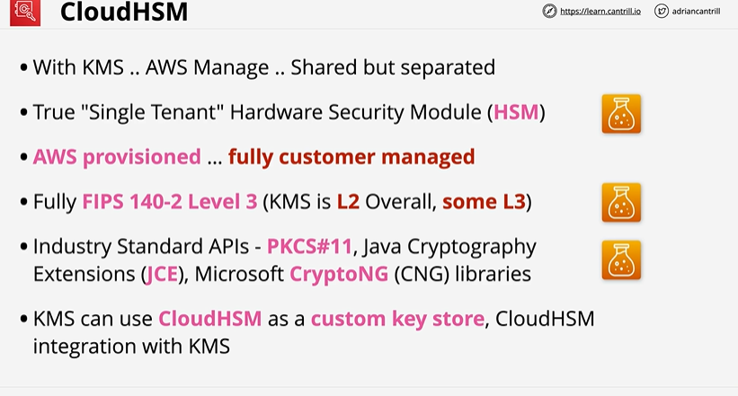
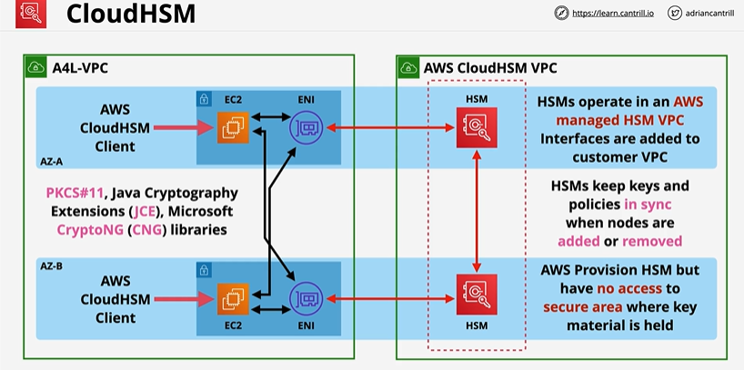
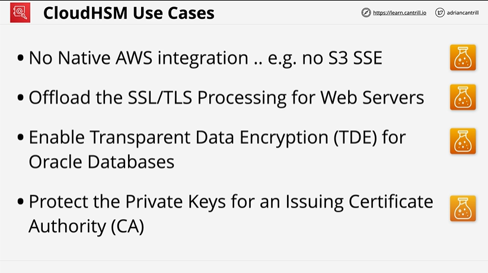

# CloudHSM

# Overview

## ⭐ What Is AWS CloudHSM?

AWS CloudHSM is a **managed Hardware Security Module (HSM)** service that provides:

* **Dedicated, single-tenant HSM appliances**
* **FIPS 140-2 Level 3** compliance
* Full **control over cryptographic keys**
* **You manage the keys**, not AWS
* HSMs run in your VPC (not AWS-owned KMS systems)
* AWS provisioned .. fully customer managed

  **Important:**
  Unlike AWS KMS, CloudHSM is **not a shared, multi-tenant managed key service**.
  You own and operate the cluster.
---

## Key Concepts
# ⭐ When to Use CloudHSM? (Exam Must-Know)

Use AWS CloudHSM when you need:

-  **FIPS 140-2 Level 3** compliance
-  **Exclusive hardware**
-  **Custom cryptographic libraries** (OpenSSL, PKCS#11, JCE, CNG)
-  **Keys under your full control**
-  **Applications that require a traditional HSM**
-  **Integrations with legacy on-prem HSM solutions**
-  **Encrypted database transparent data encryption (TDE)**
-  To store **private keys for Certificate Authorities (CA)**

CloudHSM **cannot be replaced by KMS** in these scenarios.

---

# ⭐ CloudHSM vs AWS KMS (Exam Table)

| Feature            | CloudHSM                             | KMS                                |
| ------------------ | ------------------------------------ | ---------------------------------- |
| Tenant             | **Single tenant**                    | Multi-tenant                       |
| FIPS Level         | **140-2 Level 3**                    | 140-2 Level 2                      |
| Who controls keys? | **Customer controls & manages keys** | AWS manages key infra              |
| Where?             | **VPC (HSM instances)**              | AWS-managed                        |
| Cost               | High                                 | Lower                              |
| Integrations       | PKCS#11, OpenSSL, JCE, SQL TDE       | Automatic AWS service integrations |
| Scaling            | Automatic cluster resizing           | Fully managed                      |
| Use Cases          | Custom crypto, CA, legacy workloads  | General AWS encryption             |

Exam trap:
**If the requirement says “customer controls the HSM” → Choose CloudHSM.**
If requirement is “easy service integration” → Choose **KMS**.

---

# ⭐ CloudHSM Architecture

A CloudHSM cluster consists of:

1. **HSM Instances**

    * Dedicated hardware
    * High availability via multiple AZs
    * You control key creation & lifecycle
    * HSM is injected in the customer managed VPC via ENI.

2. **CloudHSM Client**

    * Installed on EC2 or on-prem servers
    * Connects your applications to the HSM

3. **LunaJCE, PKCS#11, OpenSSL plugins**

    * Used by applications to perform encryption/decryption/signing

4. **Secure HSM network enclave in your VPC**

    * Launched in private subnets
    * Requires ENIs to communicate

---

## Use case 

# ⭐ CloudHSM Operations & Security (Exam Focus)

### ✔ AWS NEVER sees your keys

* Keys are created *inside the HSM*
* Keys **cannot be exported in plaintext**
* You manage backups (encrypted within HSM only)

### ✔ User Management

You manage users inside the HSM:

* **CO (Crypto Officer)** – creates users, policies
* **CU (Crypto User)** – performs crypto operations
* **Admins** – maintenance roles

### ✔ Scaling

CloudHSM clusters scale horizontally:

* Add more HSMs across AZs
* Load balances automatically

### ✔ Backup

Cluster is automatically backed up to S3

* Encrypted using HSM’s backup key
* AWS cannot read backups

### ✔ High Availability

Deploy HSMs in **multiple AZs**.

---

# ⭐ CloudHSM Supported Crypto APIs

CloudHSM supports:

* **PKCS#11**
* **Java JCE**
* **Microsoft CNG/KSP**
* **OpenSSL engine**

Use these when applications require “hardware-backed” crypto operations.

---

# ⭐ CloudHSM Integrations

Exam-relevant integrations:

### ✔ **Amazon RDS**

Supports CloudHSM for:

* Oracle TDE
* SQL Server TDE

### ✔ **ACM Private CA**

Can use CloudHSM to store:

* CA private keys

### ✔ **OpenSSL / web servers**

* TLS termination with private keys inside HSM

### ✔ **Custom crypto libraries**

* Signing, key wrapping, encryption

---

# ⭐ AWS CloudHSM Limitations (Exam Traps)

❌ Does NOT integrate with AWS KMS
❌ Does NOT provide automatic key rotation
❌ Does NOT automatically encrypt AWS services (EBS, S3, etc.)
❌ More expensive and complex than KMS
❌ You must manage users, policies, backups, agents

If the requirement includes words like:

* “Easy to use”
* “Automatic integration”
* “Low operational overhead”

→ **The answer is AWS KMS, not CloudHSM.**

---

# ⭐ CloudHSM vs Custom Key Store (Important Trap)

AWS KMS has a feature called **Custom Key Store**, which uses **AWS CloudHSM under the hood**.

### When to choose KMS Custom Key Store?

* You want **AWS-managed KMS APIs**
* But need keys to be stored on **dedicated HSMs**
* And need **FIPS 140-2 Level 3**
* And want **KMS integration** (S3, EBS, RDS)

### But:

Custom Key Store ≠ CloudHSM cluster you manage.

Custom Key Store = AWS manages the HSM
CloudHSM = You manage the HSM

---

# ⭐ CloudHSM Exam Questions (Short Version)

### **1. Requirement: FIPS 140-2 Level 3 + full key control → ?**

✔ **CloudHSM**

### **2. Need to store CA private keys → ?**

✔ **CloudHSM**

### **3. Want to use PKCS#11/OpenSSL libraries → ?**

✔ **CloudHSM**

### **4. Want encryption for S3/EBS/DynamoDB → ?**

✔ **KMS**

### **5. Want dedicated HSM but still automatic integration → ?**

✔ **KMS Custom Key Store**

---

## References
[FIPS_140_2](https://en.wikipedia.org/wiki/FIPS_140-2)