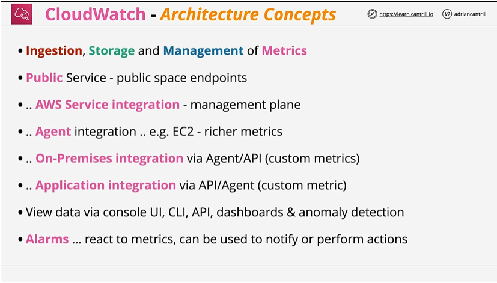
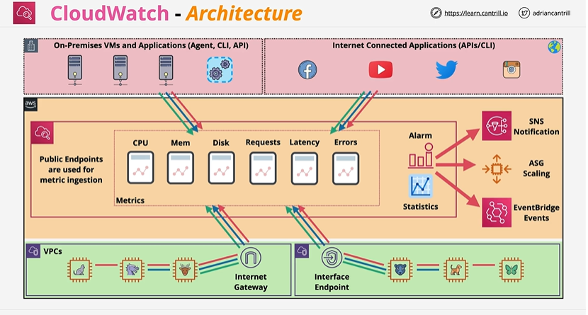
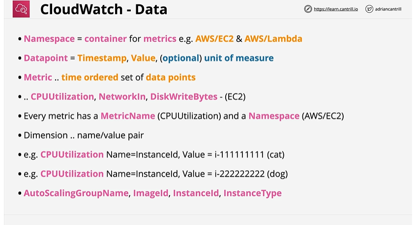
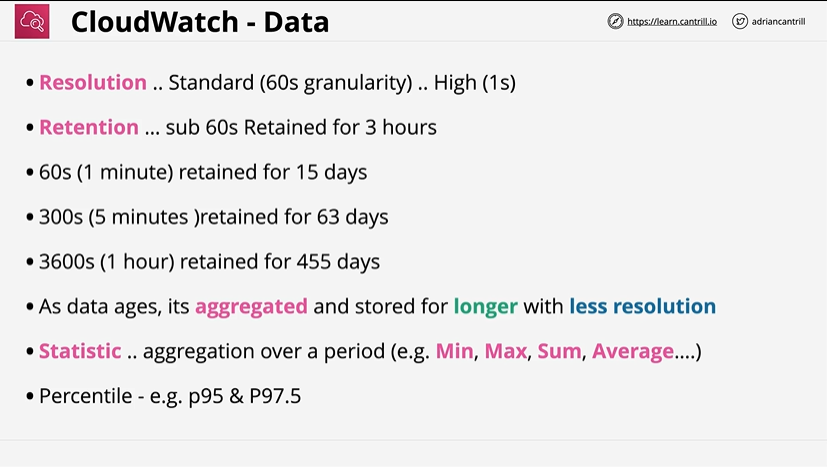
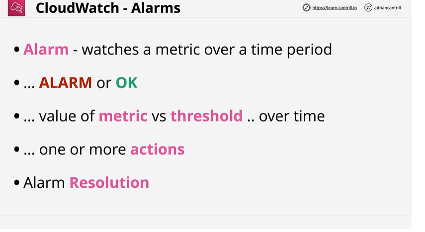
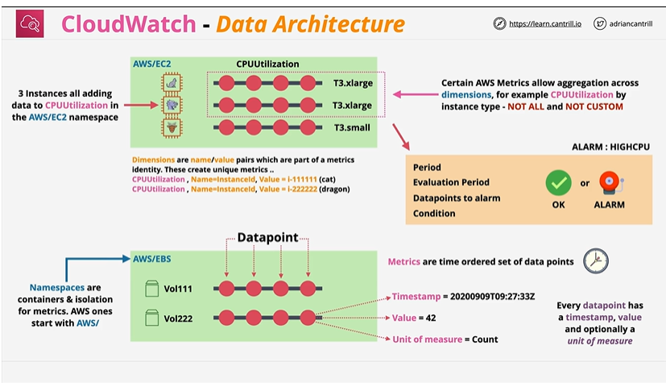

# Cloudwatch Architecture 

# ⭐ **What Is CloudWatch?**



Amazon CloudWatch is AWS’s **monitoring and observability** **public** service that collects:

* **Metrics** (numerical time-series data)
* **Logs** (application + system logs)
* **Events** (state changes)
* **Traces** (via X-Ray integration)
* **Alarms** (automated reactions)
* **Dashboards** (visualization)

CloudWatch forms the core of AWS observability.

---

# 🧱 **CloudWatch Architecture (High-Level)**


### **1. Data Sources**

CloudWatch receives metrics/logs from:

* **On-prem servers** (CloudWatch Agent, CLI, API)
* **Internet applications** (custom metrics via API)
* **AWS services** (EC2, Lambda, RDS, etc. → automatic)

All send data to CloudWatch using **public endpoints** unless PrivateLink is used.

---

### **2. Metrics Layer**

CloudWatch collects:

* CPU, Memory, Disk
* Requests, Latency, Errors
* Custom app metrics

Metrics are stored as **time-series data**.

---

### **3. Alarms & Statistics**

CloudWatch calculates statistics (avg, sum, p99, anomaly detection) and evaluates **alarms**.

Alarms can trigger:

* **SNS notifications**
* **Auto Scaling** actions
* **EventBridge** events (automation)

---

### **4. Networking**

Two ways to send metrics/logs:

1. **Internet Gateway → CloudWatch Public Endpoint**
2. **VPC Interface Endpoint (PrivateLink)** → private, secure, no internet

---

### **Flow Summary**

1. Apps/Servers/AWS Services → send metrics/logs
2. CloudWatch stores & evaluates them
3. Alarms trigger SNS / ASG scaling / EventBridge
4. Dashboards visualize everything
 
CloudWatch serves as the **central routing + storage + analytics** layer for monitoring data across AWS.

---

# ⭐ **CloudWatch Data — Short Notes**

### **1. Namespace**

A container/group for metrics.
Examples:

* `AWS/EC2`
* `AWS/Lambda`

---

### **2. Datapoint**

A single measurement:

* **Timestamp**
* **Value**
* (Optional) **Unit**

Example: CPU = 40% at 12:01 PM.

---

### **3. Metric**

A **time-ordered set of datapoints**.
Examples (EC2):

* `CPUUtilization`
* `NetworkIn`
* `DiskWriteBytes`

---

### **4. Metric Name + Namespace**

Every metric has:

* **MetricName** → e.g., `CPUUtilization`
* **Namespace** → e.g., `AWS/EC2`

---

### **5. Dimensions**

Key–value pairs that identify **which resource** the metric belongs to.
Examples:

* `InstanceId=i-1111111111`
* `InstanceId=i-2222222222`
* Other dimensions: `AutoScalingGroupName`, `ImageId`, `InstanceType`

---


 

## **1. Resolution (How often data is collected)**

**Resolution** means how frequently CloudWatch records a metric value.

* **Standard resolution (60 seconds):**
  CloudWatch stores 1 datapoint every **1 minute**.
  **Example:** CPU = 40% at 12:00, then 45% at 12:01.

* **High resolution (1–60 seconds):**
  Custom metrics can be pushed every **1 second**.
  **Example:** A trading app sending latency every 1 sec for high accuracy.

---

## **2. Retention (How long CloudWatch keeps data)**

CloudWatch keeps different granularities for different lengths:

| Metric Granularity | Example             | Retention    |
| ------------------ | ------------------- | ------------ |
| **< 60 sec**       | 1-sec custom metric | **3 hours**  |
| **60 sec**         | EC2 CPU             | **15 days**  |
| **5 min**          | Avg CPU aggregated  | **63 days**  |
| **1 hour**         | Hourly CPU average  | **455 days** |

**Example:**
Your EC2 CPU for 1-year history will only be available in **1-hour resolution**, not 1-minute.

---

## **3. Data Aging (Old data becomes less detailed)**

As data gets older, CloudWatch **compresses it into bigger time blocks**.

**Example:**

* Today you get CPU every **1 minute**
* After 2 months, CPU data becomes **every 5 minutes**
* After a year, CPU data becomes **every 1 hour**

This saves storage while keeping long-term trends.

---

## **4. Statistics (How CloudWatch summarizes data)**

CloudWatch can **aggregate** multiple datapoints into statistical values:

* **Min:** Lowest value
  *Example:* Smallest latency in 1 minute = 20 ms
* **Max:** Highest value
  *Example:* Slowest request = 800 ms
* **Sum:** Total of all values
  *Example:* 200 requests processed in 1 minute
* **Average:** Mean value
  *Example:* Avg CPU = 35%
* **SampleCount:** Number of datapoints
  *Example:* 60 datapoints in 1-minute window (from 1-sec resolution)

Used by alarms and dashboards.

---

## **5. Percentiles (Measure the “slowest” or worst-case behavior)**

Percentile = value that **X% of data is below**.

Examples:

* **p95 = 95th percentile:**
  95% of requests are **faster** than this number.
  If p95 latency = 300 ms → only the worst 5% are slower.

* **p99 = 99th percentile:**
  Shows extreme slow requests.

**Real example:**
If a Lambda function often takes 50 ms on average but p95 is 400 ms,
→ some requests are **spiking and slow**, even if average looks fine.

---
# ⭐ **CloudWatch Alarms **



---

## **1. Namespaces**

Namespaces are **containers** that separate metrics.

* Example:

    * EC2 metrics live in `AWS/EC2`
    * EBS metrics live in `AWS/EBS`
* Think of namespaces like **folders** for metrics.

---

## **2. Metrics**

A metric is a **time-ordered set of datapoints**.

* Example: CPUUtilization values for an EC2 instance over time:
  `30% → 45% → 50% → 42% …`

Every metric belongs to:

* A **namespace** (`AWS/EC2`)
* A **metric name** (`CPUUtilization`)
* **Dimensions** (resource identifiers)

---

## **3. Dimensions**

Dimensions are **name/value pairs** that uniquely identify *which* resource the metric refers to.

* Example EC2 dimensions:

    * `InstanceId = i-11111111` (cat)
    * `InstanceId = i-22222222` (dragon)

Each dimension combination creates a **distinct metric** in CloudWatch.

---

## **4. Metric Aggregation Across Dimensions**

Some AWS services let you **aggregate metrics by dimension**.

* Example:
  CPUUtilization aggregated by **InstanceType**:

    * All T3.large instances grouped together
    * All T3.small instances grouped together

**Important:**

* Only supported for **some AWS metrics**.
* **Not allowed for custom metrics**.

---

## **5. Datapoints**

A **datapoint** is a single measurement stored in CloudWatch.

Each datapoint contains:

* **Timestamp** → when the measurement happened
* **Value** → the measurement itself
* **Unit** (optional) → e.g., Percent, Count, Bytes

Example:
`Timestamp: 2020-09-09T09:27:33Z`
`Value: 42`
`Unit: Count`

Multiple datapoints → form **one metric**.

---

## **6. Example: EC2 CPUUtilization Metric**

The diagram shows 3 EC2 instances (T3.xlarge, T3.large, T3.small) all sending data for:

* **MetricName:** CPUUtilization
* **Namespace:** AWS/EC2
* **Dimension:** InstanceId

    * Each instance sends its own datapoints
    * CloudWatch stores them as **3 separate metrics**

---

## **7. Example: EBS Volume Metrics**

In the EBS namespace (`AWS/EBS`):

* `Vol111` sends its datapoints
* `Vol222` sends its datapoints

Each volume = its own metric due to **dimension = VolumeId**.

---

## **8. Alarms**

Alarms evaluate metric values based on:

* **Period** → e.g., 1 minute
* **Evaluation Period** → e.g., 5 periods
* **Datapoints to alarm** → e.g., 3 out of 5
* **Condition** → CPU > 80%

Alarms can be **OK** or **ALARM** depending on metric values.

Example:
“If CPUUtilization > 80% for 3 out of 5 minutes → ALARM.”

---

# ⭐ **Quick Summary**

* **Namespaces** = Folders that isolate metrics (e.g., AWS/EC2).
* **Metrics** = Time series of data (e.g., CPU over time).
* **Dimensions** = Resource identifiers (e.g., InstanceId).
* **Datapoints** = Individual measured values + timestamp.
* **Aggregation** = Group metrics by dimension (like instance type).
* **Alarms** = Trigger actions based on metric thresholds.
---
# ⭐ **CloudWatch Architecture Components (Detailed)**

# 1️⃣ **CloudWatch Metrics**

### ✔ Metrics are **numerical time-series data**

Examples:

* CPUUtilization
* Memory (custom metric)
* StatusCheckFailed
* SQS queue depth
* API Gateway latency
* Lambda invocation counts

### ✔ Metric structure:

* **Namespace** (e.g., `AWS/EC2`)
* **Metric Name**
* **Timestamp**
* **Value**
* **Dimensions** (metadata like `InstanceId`)

### ✔ Types of metrics

| Metric Type         | Example            | Notes                  |
| ------------------- | ------------------ | ---------------------- |
| **Basic**           | EC2 CPU            | 5-min resolution, free |
| **Detailed**        | EC2 CPU (detailed) | 1-min resolution       |
| **High-resolution** | Custom metrics     | 1-second resolution    |

Exam tip ↓
**Lambda sends metrics every minute automatically.**

---

# 2️⃣ **CloudWatch Logs**

CloudWatch Logs consists of:

### **Log Groups**

→ e.g. `/aws/lambda/myFunction`

### **Log Streams**

→ e.g. a single Lambda instance

### Sources:

* Lambda logs (auto)
* API Gateway logs
* VPC Flow Logs
* CloudTrail logs (optional)
* EC2 logs via **CloudWatch Agent**
* ECS container logs
* EKS cluster logs

### ✔ Log Retention

Configurable: 1 day → ∞

### ✔ CloudWatch Logs Insights

Query language for logs:

```
fields @timestamp, @message
| filter status = 500
| stats count(*) by path
```

---

# 3️⃣ **CloudWatch Events / EventBridge (New Name)**

CloudWatch Events evolved into **Amazon EventBridge**.

Used for:

* Automation
* Scheduled jobs (cron)
* Event-driven architecture
* Reacting to AWS changes
* Integrating SaaS systems

Example rule:
“When EC2 instance state = stopped → trigger Lambda.”

---

# 4️⃣ **CloudWatch Alarms**

### Alarms monitor:

* **Metrics**
* **Composite alarms** (AND/OR logic)
* **Anomaly detection**

### Alarm States:

* **OK**
* **ALARM**
* **INSUFFICIENT_DATA**

### Alarm actions:

* SNS notification
* Auto Scaling action
* SSM actions
* Lambda invocation
* EC2 reboot/stop/terminate/recover

Exam tip ↓
**Alarm actions only occur when transitioning into ALARM state (by default).**

---

# 5️⃣ **CloudWatch Dashboards**

* Custom dashboards for metrics + logs
* Can combine data from multiple regions
* Cost: ~$3 per dashboard per month
* Supports widgets, metrics, logs queries

---

# 6️⃣ **Metric Filters (CloudWatch Logs → Metrics)**

Convert log patterns into metrics.

Example: Count 404 errors:

```
filter: "404"
metric value: 1
```

Used to alarm on logs.

---

# 7️⃣ **CloudWatch Agent**

Use the agent to collect:

### ✔ System-level metrics

* Disk space
* Memory
* Processes
* Swap usage

### ✔ Application logs

Collected from EC2, on-prem servers, ECS.

Agent types:

* **CloudWatch Agent (Unified)** → metrics + logs
* **StatsD / collectd** support for custom app metrics

---

# ⭐ **CloudWatch Integrations**

### ✔ Auto Scaling

Scale based on CloudWatch metrics (CPU, queue depth, custom metrics).

### ✔ Lambda

Sends logs & metrics automatically.

### ✔ ECS/EKS

Container logs and performance metrics.

### ✔ API Gateway

Log requests, latency, status codes.

### ✔ Route 53 Health Checks

Alarms on endpoint health.

### ✔ CloudTrail

Send API call logs into CloudWatch Logs.

---

# ⭐ CloudWatch Log Lifecycle

1. App or Service generates logs
2. Logs sent to CloudWatch Logs
3. Logs stored in **log groups**
4. Retention policy applied
5. Optionally:

    * **Metric Filters**
    * **Subscription Filters** → Kinesis, Lambda, Firehose
    * **Insights Queries**

---

# 🧠 **CloudWatch vs CloudTrail vs X-Ray (Important Exam Question)**

| Feature     | CloudWatch                | CloudTrail     | X-Ray               |
| ----------- | ------------------------- | -------------- | ------------------- |
| Purpose     | Monitoring, metrics, logs | API auditing   | Distributed tracing |
| Data type   | Metrics + logs            | AWS API calls  | Traces/segments     |
| Who uses it | DevOps/Monitoring         | Security/GRC   | Developers/APM      |
| Retention   | Configurable              | 90 days (free) | 30 days by default  |

---

# ⭐ **Common Exam Scenarios**

### 1. Need memory metrics for EC2 →

✔ Install **CloudWatch Agent**

### 2. Trigger Lambda every 5 minutes →

✔ CloudWatch Events (EventBridge scheduled rule)

### 3. Alarm on “error” in application logs →

✔ CloudWatch Logs → Metric Filter → Alarm

### 4. Collect custom logging from ECS →

✔ Fluent Bit → CloudWatch Logs
or
✔ CloudWatch Agent

### 5. Analyze 1TB of logs →

✔ CloudWatch Logs Insights

### 6. Asynchronous log processing →

✔ Subscription Filter → Kinesis / Lambda

### 7. Alert when SQS queue has > 100 messages →

✔ CloudWatch Alarm on queue depth metric

---

# ⭐ **Exam Tips & Traps**

* CloudWatch is **regional**.
* Alarms cannot monitor cross-region metrics directly.
* Logs are stored in **CloudWatch Logs**, not in S3 (unless exported).
* To get disk/ram metrics from EC2 → install **CloudWatch Agent**
* Lambda logs automatically pushed to CloudWatch Logs.
* EventBridge (formerly CloudWatch Events) is used for **event-driven automation**.
* High-resolution custom metrics can be **1-second** granularity.

---

