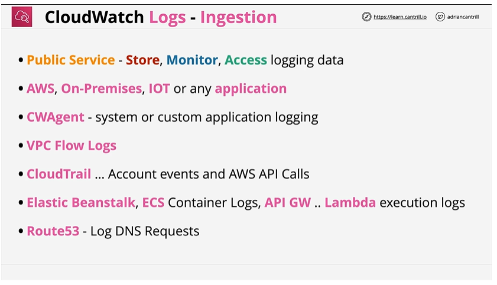
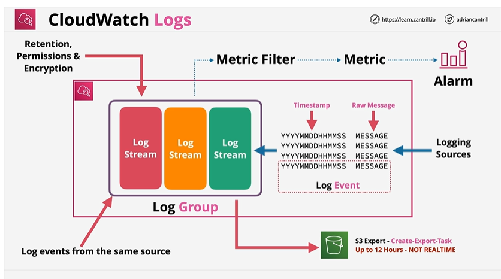
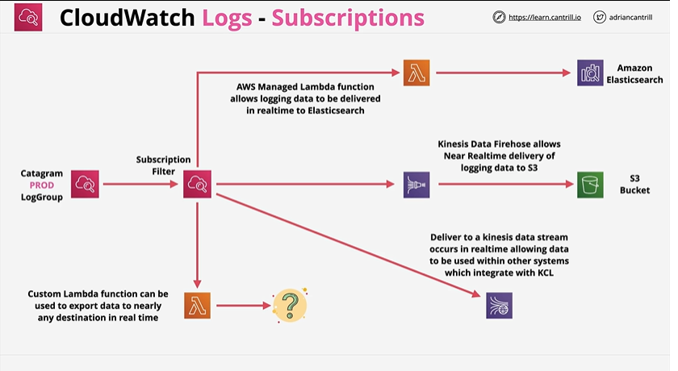
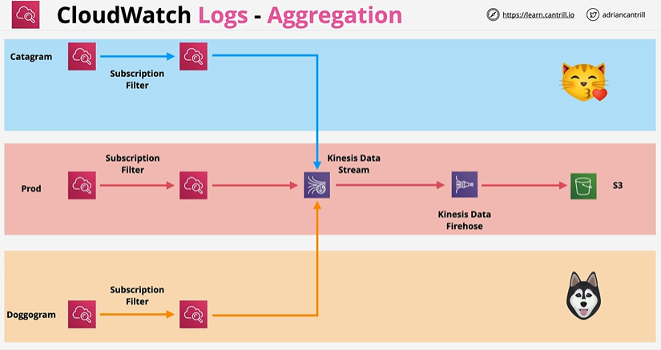
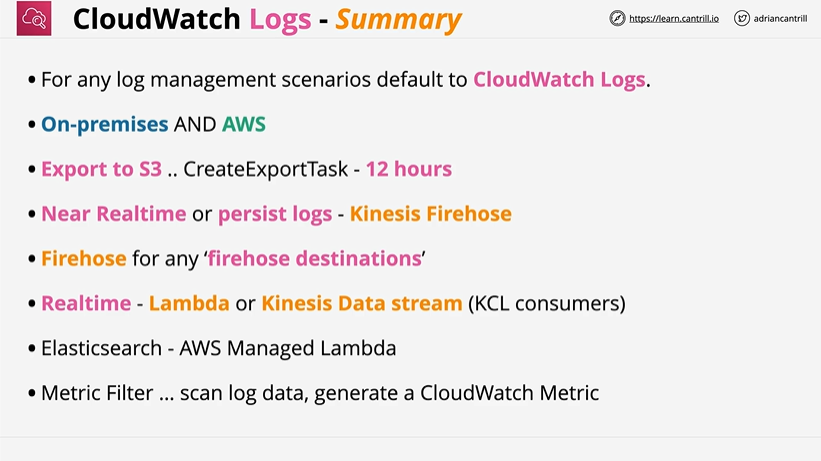

# Cloudwatch Logs

## Overview


# ⭐ **CloudWatch Logs – Ingestion**

### **🔸 Public Service – Store, Monitor, Access**

CloudWatch Logs is a **public AWS service** used to **collect, store, monitor, search, and access logs** from any source.

**Example:**
Search Lambda errors or EC2 syslogs in CloudWatch Logs.

---

### **🔸 AWS, On-Premises, IoT, or Any Application**

CloudWatch can ingest logs from **any environment**:

* AWS services
* On-prem servers
* IoT devices
* Custom apps

**Example:**
A mobile app sending custom logs using the AWS SDK.

---

### **🔸 CWAgent (CloudWatch Agent)**

The **CloudWatch Unified Agent** sends system logs and application logs from:

* EC2 instances
* On-prem servers
* Hybrid setups

**Example:**
Sending `/var/log/nginx/access.log` from EC2 to CloudWatch Logs.

---

### **🔸 VPC Flow Logs**

VPC Flow Logs capture **network traffic metadata** and send it to CloudWatch Logs.

**Example:**
Log all accepted and rejected connections inside a VPC subnet or ENI.

---

### **🔸 CloudTrail**

CloudTrail records **AWS API calls and account events**, and these logs can be delivered to CloudWatch Logs.

**Example:**
See who terminated an EC2 instance or changed a security group.

---

### **🔸 Elastic Beanstalk, ECS, API Gateway, Lambda**

Many AWS services **automatically send logs** into CloudWatch Logs.

Examples:

* **Elastic Beanstalk** → application & environment logs
* **ECS** → container stdout/stderr logs
* **API Gateway** → access & execution logs
* **Lambda** → execution logs (console.log / print)

---

### **🔸 Route 53 – DNS Query Logging**

Route 53 can send **DNS query logs** into CloudWatch Logs.

**Example:**
View which domain names users queried and from which IP.

---
# ⭐ **CloudWatch Logs – Architecture**


# 🔶 1. **Logging Sources → Log Events**

Any service or application sends **log events** to CloudWatch.

Each **log event** contains:

* **Timestamp** (when it happened)
* **Raw message** (the log text)

**Example:**
`2025-02-10T12:00:04Z ERROR: Database timeout`

---

# 🔶 2. **Log Group**

A **Log Group** is a folder that stores related logs.

Examples of Log Groups:

* `/aws/lambda/myFunction`
* `/ecs/my-service`
* `/var/log/messages`

Log Groups define:

* **Retention policy**
* **Permissions**
* **KMS encryption**

---

# 🔶 3. **Log Streams inside each Log Group**

A **Log Stream** is a sequence of logs from a **single source instance**.

Examples:

* Each Lambda instance = 1 log stream
* Each ECS task = 1 log stream
* Each EC2 agent = 1 log stream

Log Streams keep logs **ordered and separated** by source.

---

# 🔶 4. **Metric Filters → Metrics**

Metric Filters allow CloudWatch to scan logs for patterns and convert them into metrics.

**Example:**
Filter: `"ERROR"`
Creates a metric: **ErrorCount** = number of ERROR logs

This metric can then trigger a CloudWatch Alarm.

---

# 🔶 5. **Metrics → Alarms**

Once a metric is created, a CloudWatch **Alarm** can monitor it.

**Example:**
“If ErrorCount > 10 in 5 minutes → ALARM”

Alarm actions:

* Notify via SNS
* Trigger Lambda
* Trigger Auto Scaling
* Send EventBridge events

---

# 🔶 6. **S3 Export (Not Real-Time)**

Logs can be exported from CloudWatch Logs to **S3** using a **Create-Export-Task**.

**Important Notes:**

* **Not real-time**
* Can take **up to 12 hours**
* Used for archival, analytics, or compliance

**Example:**
Export `/aws/lambda/*` logs to S3 for long-term storage.

---

# 🔶 7. **Retention, Permissions, Encryption**

At the Log Group level you can configure:

### ✔ Retention

* 1 day → 10 years or Never Expire

### ✔ Permissions

* IAM who can read/write logs

### ✔ Encryption

* CloudWatch Logs encrypt log data using **KMS CMK**

---

# ⭐ **Full Flow Summary**

1. **Logs come in** → From AWS services, apps, EC2, containers
2. **Stored as log events** → timestamp + message
3. **Organized into Log Streams** → one per instance/task
4. **Grouped into Log Groups** → same app/service
5. **Metric Filters convert log patterns to metrics**
6. **Alarms fire based on those metrics**
7. **Logs can be exported** to S3 (batch, not real-time)

---

# ⭐ One-Line Summary

**CloudWatch Logs collects log events, organizes them into streams & groups, applies metric filters, triggers alarms on patterns, and optionally exports logs to S3.**

---

# **Cloudwatch Logs- Subscription**


A **Subscription Filter** lets CloudWatch Logs **stream log events in real time** to another service for processing, storage, analytics, or alerting.

Think of it as:
**“When a new log arrives → send it somewhere immediately.”**

---

# 🔶 1. **Subscription Filter**

A filter attached to a **Log Group** that decides:

* which logs to stream
* and where to send them (destination)

**Example:**
Forward all logs containing `"ERROR"` to a processing system.

---

# 🔶 2. **Destination: AWS Managed Lambda → Amazon Elasticsearch (OpenSearch)**

AWS provides a **pre-built Lambda function** that:

* receives log batches
* decompresses + transforms them
* sends them to **Elasticsearch/OpenSearch**

**Use case:**
Search, visualize, and analyze logs using Kibana/OpenSearch dashboards.

---

# 🔶 3. **Destination: Kinesis Data Firehose → S3 (near real-time)**

Logs are streamed from CloudWatch Logs to:

1. **Kinesis Data Firehose**
2. Firehose batches/compresses/logs
3. Stores them in **S3**

**Use case:**

* Long-term log storage
* BigData analytics (Athena, EMR, Glue)
* Compliance archives

Firehose = “near real time” (seconds → minutes).

---

# 🔶 4. **Destination: Kinesis Data Stream**

Logs can be streamed into a **Kinesis Data Stream** for real-time processing.

**Use case:**

* Real-time log analytics
* Security event processing
* Custom monitoring systems
* Apps using the **Kinesis Client Library (KCL)**

---

# 🔶 5. **Destination: Custom Lambda Function**

Attach your own Lambda function to a Log Group.

Your Lambda receives logs **instantly**, and you can send them anywhere:

* Third-party logging tools (Datadog, Splunk, New Relic)
* Internal REST API
* Slack alerts
* Database insert
* Custom dashboards

**Example:**
Forward error logs to Slack using a Lambda subscription.

---

# 🔶 6. **Flow Summary**

```
Log Group
   ↓
Subscription Filter
   ↓
(destinations)
→ Lambda (managed) → ElasticSearch  
→ Firehose → S3  
→ Kinesis Stream  
→ Lambda (custom) → any system  
```

---

# ⭐ **Important Exam Notes**

* Subscriptions operate in **real time** (near real time for Firehose).
* **Each Log Group can have multiple subscription filters.**
* Commonly used for **centralized logging**, **SIEM ingestion**, and **log analytics**.
* Required when integrating with **third-party log platforms**.
* You **cannot** export real-time logs directly to S3 without **Firehose**.

---

# ⭐ **1-Liner Summary**

**CloudWatch Logs subscriptions continuously stream logs from a Log Group to Lambda, Firehose, Kinesis Streams, or Elasticsearch for real-time processing and storage.**

---

# ⭐ **CloudWatch Logs - Aggregation**



This diagram shows **how logs from multiple Log Groups** (different applications) can be **aggregated into one central pipeline** using **Subscription Filters + Kinesis**.

---

# 🔹 **1. Different Applications Have Their Own Log Groups**

There are **three separate applications**, each with its own CloudWatch Log Group:

* **Catagram** (blue)
* **Prod** (red)
* **Doggogram** (yellow)

Each Log Group = separate logs, separate environments.

---

# 🔹 **2. Each Log Group Uses a Subscription Filter**

A **Subscription Filter** streams logs out of CloudWatch Logs *in real time*.

For each app:

* Catagram → Subscription Filter
* Prod → Subscription Filter
* Doggogram → Subscription Filter

These filters decide **which logs** and **where** to forward them.

---

# 🔹 **3. All Logs Are Aggregated into a Single Kinesis Data Stream**

All three apps send logs to **the same Kinesis Data Stream**.

This allows **centralized processing**.

**Why do this?**

* Combine logs from multiple apps
* Send them to the same analytics system
* Unified monitoring / security analysis
* Build a single processing pipeline

---

# 🔹 **4. Kinesis Data Stream → Kinesis Data Firehose → S3**

The Kinesis Stream sends log batches to:

### **Kinesis Data Firehose**

* Automatically buffers, compresses, transforms logs
* Sends them **near real-time** to a destination

### **Destination: S3**

All aggregated logs from all apps land in **one S3 bucket**.

**Use cases:**

* Long-term retention
* BigData analytics (Athena, EMR, Glue)
* Centralized SIEM
* Auditing & compliance

---

# 🔹 **5. Why Do We Use Aggregation?**

Aggregation allows:

✔ Centralized log storage
✔ Single analytics pipeline
✔ Combine logs from multiple systems
✔ Easier reporting & monitoring
✔ Multi-application log correlation
✔ Simplifies architecture

Example:
If Catagram, Prod, and Doggogram all generate logs, you can analyze **all errors** across all systems from **one S3 dataset**.

---

# ⭐ **Flow Summary (Very Simple)**

```
Catagram Log Group → Subscription Filter →  
                         ↓
Prod Log Group → Subscription Filter → → Kinesis Stream → Firehose → S3  
                         ↑
Doggogram Log Group → Subscription Filter →
```

All apps → One Stream → One Firehose → One S3 destination.

---

## Summary


