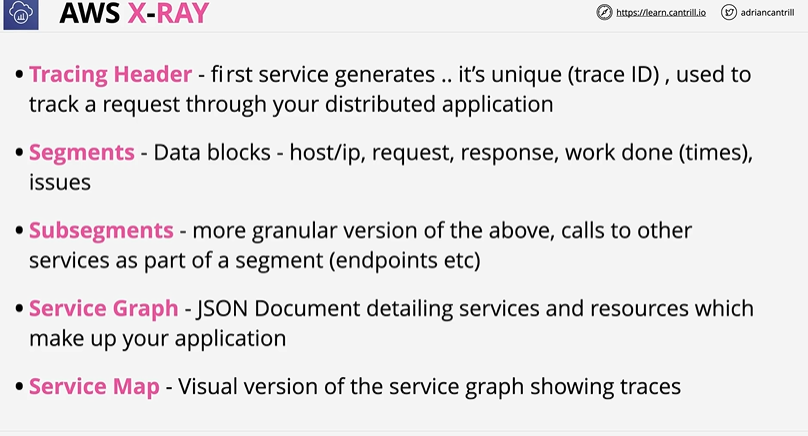
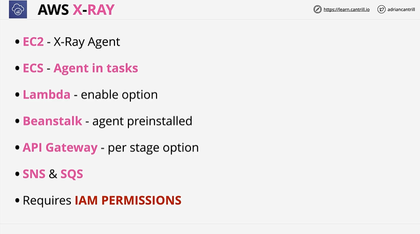

# ☁️ **AWS X-Ray**

AWS X-Ray is AWS’s **distributed tracing** service.
It helps you **visualize, analyze, and debug** requests as they travel through **microservices**, **Lambda**, **API Gateway**, **ECS**, **EKS**, **DynamoDB**, etc.

Think of it as **“a request journey viewer.”**

---

# ⭐ 1. What Does X-Ray Do?

X-Ray helps developers:

✔ Trace requests end-to-end
✔ See where latency occurs (slow services)
✔ Find bottlenecks or timeouts
✔ Identify errors and faults
✔ Visualize microservice interactions
✔ Measure performance across distributed systems

Used heavily in **serverless** and **microservices** architectures.

---

# ⭐ 2. X-Ray Core Concepts



## 🔹 **1. Tracing Header**

* The **first service** that receives a request creates a **unique Trace ID**.
* This Trace ID travels through all services so X-Ray can rebuild the request path.

**Example:**
API Gateway generates a Trace ID → passes to Lambda → passes to DynamoDB → shows full journey.

---

## 🔹 **2. Segments**

* A **segment** represents what a single service does for a request.
* It includes **host/IP**, **request info**, **response time**, and **errors**.

**Example:**
Lambda processing = one segment
EC2 processing = another segment

---

## 🔹 **3. Subsegments**

* A **subsegment** is a smaller part inside a segment.
* Used to trace **downstream calls** inside a service.

**Examples of subsegments:**

* DynamoDB query inside a Lambda
* S3 GET request inside an EC2 app
* Calling an external API

Subsegments help you find exactly where delays occur.

---

## 🔹 **4. Service Graph**

* A **JSON document** that X-Ray generates, describing:

    * All services involved
    * How they connect
    * Latency and error info
* Raw data used to build the visual map.

**Example:**
JSON showing:
API Gateway → Lambda → DynamoDB

---

## 🔹 **5. Service Map**

* The **visual diagram** of the Service Graph.
* Shows nodes (services) and edges (connections) with:

    * Latency
    * Errors
    * Faults
    * Request counts

**Example:**
You see a bubble map:
API Gateway → Lambda → DynamoDB
where DynamoDB node glows red if failing.

---

# ⭐ **Quick Summary (1-Liner Each)**

* **Tracing Header:** Creates unique trace ID → follows entire request path.
* **Segment:** One service’s work (request → response).
* **Subsegment:** Details inside a service (e.g., DB call).
* **Service Graph:** JSON representation of full application trace.
* **Service Map:** Visual map showing how services talk to each other.

---

# ⭐ 3. How X-Ray Works (Simple Architecture)

```
1. Client request
      ↓
2. X-Ray SDK or AWS service instruments the request
      ↓
3. Segments/Subsegments generated
      ↓
4. Data sent to X-Ray Daemon/Agent
      ↓
5. X-Ray service builds traces + service map
```

AWS services like **Lambda, API Gateway, Step Functions** have **native X-Ray integration**.

---

# ⭐ 4. X-Ray Instrumentation

To collect tracing data, you must **instrument** your application.

Options:

### ✔ Native AWS Integration (No SDK needed)

* API Gateway
* Lambda
* Step Functions
* Elastic Load Balancer
* AppSync
* DynamoDB (via SDK tracing)
* S3

Just enable X-Ray in the service settings.

---

### ✔ X-Ray SDK (for applications)

Install AWS X-Ray SDK in the application code:

Supports:

* Java
* Python
* Node.js
* Go
* .NET
* Ruby

This creates segments/subsegments for:

* inbound requests
* downstream calls
* custom logic timing

---

### ✔ X-Ray Daemon / Agent

Runs as:

* A process on EC2
* A sidecar in ECS/EKS
* Built-in for Lambda

The daemon receives trace data and forwards it to the X-Ray service.

---

# ⭐ 5. Sampling

Sampling controls **how many requests** are traced.

Default sampling rule:

* 1 request per second
* AND 5% of remaining traffic

You can create **custom sampling rules**.

**Why sampling?**

* Reduce cost
* Reduce overhead
* Avoid too much trace data

---

# ⭐ 6. Annotations & Metadata

### **🔸 Annotations**

Indexed key-value data → searchable.

Example:
`"userType": "premium"`

Used to filter traces in X-Ray console.

---

### **🔸 Metadata**

Non-indexed contextual data.

Example:
`"cartItems": ["book", "keyboard"]`

Stored for detailed debug.

---

# ⭐ 7. X-Ray + AWS Services (Important)

### **X-Ray works with:**

* API Gateway
* Lambda
* Step Functions
* EC2
* ECS (sidecar daemon)
* EKS (DaemonSet / sidecar)
* DynamoDB
* SQS
* SNS
* S3
* App Mesh
* AppSync

### **Does NOT automatically work with:**

* RDS directly (traced via SDK)
* On-prem apps (need SDK + daemon)

---

# ⭐ 8. Use Cases (Exam-Friendly)

✔ Debug slow APIs
✔ Visualize microservice latency
✔ Trace Lambda → API Gateway → DynamoDB
✔ Identify performance bottlenecks
✔ Track errors/faults through system
✔ Analyze cold starts
✔ Compare path timing across requests

---

# ⭐ 9. Common Exam Scenarios

### **Scenario 1**: You need request-level visibility across microservices.

→ **Use AWS X-Ray**

---

### **Scenario 2**: Need to see which downstream call inside Lambda is slow.

→ **Subsegments**

---

### **Scenario 3**: Trace real user IDs or environment info.

→ **Annotations**

---

### **Scenario 4**: ECS tasks need tracing.

→ **Run X-Ray Daemon as sidecar**

---

### **Scenario 5**: Only trace 10% of requests

→ **Custom Sampling Rule**

---

# ⭐ 10. One-Line Summary

**AWS X-Ray provides end-to-end distributed tracing so you can see where requests spend time, find slow services, and debug microservice architectures.**

---
# ⭐ **AWS X-Ray – Service Map**

The **Service Map** visually shows how a request flows through all services in a distributed system — including latency, request count, and errors.

# 🔹 **1. Request enters the system → API Gateway**

The user makes a request (top-left).
API Gateway generates a **Tracing Header** (Trace ID) and passes it through all services.

* Example:
  `avg 290ms, 52 t/m`
  → API Gateway took an average of 290ms and handled 52 traces per minute.

---

# 🔹 **2. API Gateway calls downstream services**

From the API Gateway, the request flows to multiple Lambda functions:

### Path 1:

API Gateway → **Lambda: catagram-putimg**
→ **avg 900ms**

Then Lambda → **DynamoDB Table: images**
→ **avg 7ms**

---

### Path 2:

API Gateway → **Lambda: catagram-loadtimeline**
→ **avg 400ms**

Then Lambda → **DynamoDB (Timestream)**
→ **avg 9ms**

---

# 🔹 **3. What the Service Map Shows**

The circles (green nodes) represent each service, annotated with:

### ✔ Average response time

(e.g., “avg 900ms”)

### ✔ Request throughput

(e.g., “43 t/m” = 43 traces per minute)

### ✔ Errors or faults

(nodes turn red/yellow if issues appear)

### ✔ End-to-end request path

You can see exactly which path the request takes.

---

# 🔹 **4. Arrows show the Request Flow**

Arrows represent service-to-service calls.

* Thick/red arrows = slower or error-prone paths
* Thin arrows = faster or lower-latency paths

Example:
Requests flow *from* API Gateway *to* two different Lambda functions and then to two DynamoDB tables.

---

# 🔹 **5. Trace IDs Flow Across All Services**

The Tracing Header ensures the same request is tracked across all components.

This allows X-Ray to stitch together the full trace.

---

# ⭐ **Why the Service Map Is Useful**

✔ Shows which service is slow (e.g., Lambda taking 900ms)
✔ Shows downstream calls (e.g., DynamoDB only takes 7ms)
✔ Helps find bottlenecks in microservices
✔ Identifies which service is throwing errors
✔ Visualizes complex distributed architectures
✔ Helps tune performance and debug production issues

---

# ⭐ **One-Line Summary**

**The X-Ray Service Map gives a visual overview of request flow across services, showing latency, throughput, and errors for each service node.**

---


