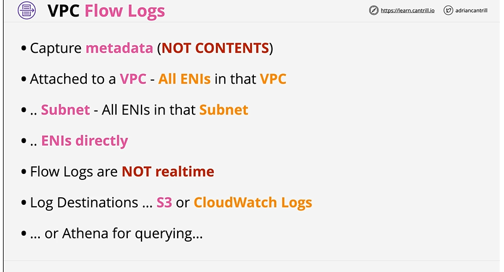
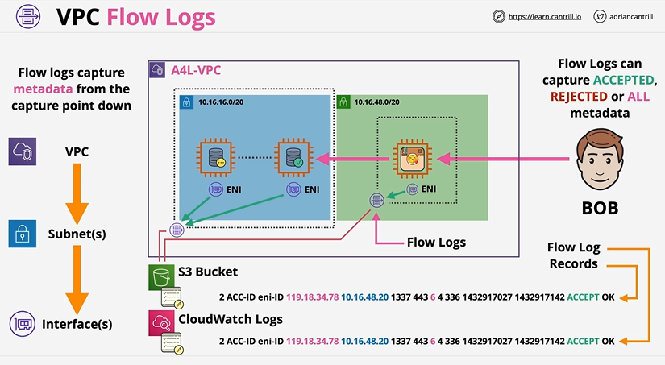
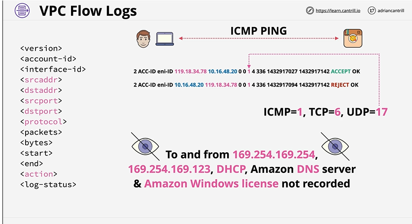

## ✅ **What are VPC Flow Logs?**

VPC Flow Logs capture only **network traffic metadata** going **to and from**:

* **VPC**
* **Subnets**
* **Network Interfaces (ENIs)** — most commonly used
  They **do NOT log packet contents**, only connection-level info.
* Works by attaching virtual monitor within VPC. Can be applied at 3 different levels - VPC, Subnets, ENIs.

NOTE: Only captures **Metadata(not contents)** and is **not realtime**.

Useful for:

* Security analysis
* Troubleshooting connectivity
* Compliance and auditing
* Cost and traffic pattern analysis



---
# ⭐ Architecture


This architecture shows how **VPC Flow Logs capture network traffic metadata** from different levels inside a VPC.

### **1️⃣ Capture Levels (Left side)**

Flow logs can be enabled at:

* **VPC level** → captures ALL subnets & ENIs
* **Subnet level** → captures ENIs inside that subnet
* **ENI (Interface) level** → captures only that ENI

**Capture happens “from the point DOWN.”**

---

### **2️⃣ Traffic Being Logged (Center)**

The VPC has two subnets with instances (ENIs).
Flow Logs record:

* Source & destination IPs
* Ports
* Protocol
* ACCEPT / REJECT status

Traffic to/from a user (BOB) is also logged.

---

### **3️⃣ Destinations (Bottom)**

Flow log records can be delivered to:

* **S3 Bucket** (for storage, Athena queries)
* **CloudWatch Logs** (for analysis, Insights queries)

Each log entry shows metadata like source IP, destination IP, ports, bytes, and **ACCEPT/REJECT**.

---

### ⭐ In One Line

**VPC Flow Logs capture network traffic metadata from VPC/Subnet/ENI levels and send it to CloudWatch or S3 for monitoring, troubleshooting, and security analysis.**

# ⭐ Where can Flow Logs be sent?

You can send logs(aka flow logs) to:

1. **CloudWatch Logs**
2. **S3**
3. **Kinesis Data Firehose** → S3 / Splunk / custom destinations / Athena

---

# ⭐ What is recorded? (Default log format fields)

A flow log record includes fields such as:

| Field                 | Meaning                           |
| --------------------- | --------------------------------- |
| `srcaddr`             | Source IP                         |
| `dstaddr`             | Destination IP                    |
| `srcport` / `dstport` | Ports                             |
| `protocol`            | TCP (6), UDP (17), ICMP (1), etc. |
| `action`              | `ACCEPT` or `REJECT`              |
| `bytes` / `packets`   | Amount of traffic                 |
| `start` / `end`       | Time window for aggregation       |

> NOTE : **Flow logs** shows the result of traffic flows as they're evaluated. **Security group** are stateful so they only evaluate the conversation itself which included the request and the response. **Network ACLs** are stateless so they consider traffic flows as two separate parts, request and response, and both of these are evaluated separately.
---

# ⭐ **Key Concepts**



### **1. Log status**

| Status   | Meaning                         |
| -------- | ------------------------------- |
| `ACCEPT` | Allowed by Security Groups/NACL |
| `REJECT` | Explicitly denied               |
| `ALL`    | Both                            |

---

### **2. VPC Flow Logs do NOT capture:**

❌ DNS queries made by DNS resolver
❌ Windows license activation traffic
❌ Traffic from the AWS managed network interfaces
❌ Traffic to **169.254.169.254** (Instance Metadata Service)
❌ Packet contents (only metadata)

---

### **3. Flow log granularity**

You can create flow logs at:

* **VPC level**
* **Subnet level**
* **ENI (Elastic Network Interface) level** → most detailed

Logs inherit rules:

* If you set at ENI → logs only for that ENI
* If set at Subnet → covers all ENIs in subnet
* If set at VPC → covers all subnets & ENIs inside VPC

---

### **4. Aggregation period**

Two options:

* **1 minute**
* **10 minutes**
  AWS aggregates flows before writing a record.

---

### **5. Delivery options**

* JSON and Parquet formats supported
* S3 supports lifecycle rules → cost optimization
* CloudWatch supports metric filters / insights queries

---

# ⭐ Common Use Cases

### **Security**

* Detect port scans
* Identify suspicious IPs
* Track “REJECT” traffic

### **Troubleshooting**

* “Why can’t my EC2 connect to DB?”
* Diagnose network ACL or SG issues

### **Compliance & Auditing**

* Track all network communication for regulated workloads

---

# ⭐ Example: Flow Log Entry (Exam Awareness)

```
2 123456789012 eni-1235 10.0.1.5 54.240.197.15 443 49152 6 10 840 1627891234 1627891294 ACCEPT OK
```

---

# ⭐ How to enable VPC Flow Logs (Simple Steps)

1. Go to **VPC Console → Your VPCs / Subnets / ENIs**
2. Select resource → **Actions → Create flow log**
3. Choose:

    * **Filter**: ACCEPT / REJECT / ALL
    * **Destination**: CloudWatch Logs / S3 / Firehose
4. Configure IAM role (for CW Logs)
5. Create

Logs begin delivering within a few minutes.

---

# ⭐ VPC Flow Logs vs AWS CloudTrail vs ELB Access Logs (Interview!)

| Feature                  | VPC Flow Logs | CloudTrail | ELB Access Logs |
| ------------------------ | ------------- | ---------- | --------------- |
| Logs network traffic     | ✅             | ❌          | Partial         |
| Logs API calls           | ❌             | ✅          | ❌               |
| Helps debug connectivity | ✅             | ❌          | Partial         |
| Logs packet contents     | ❌             | ❌          | ❌               |

---

