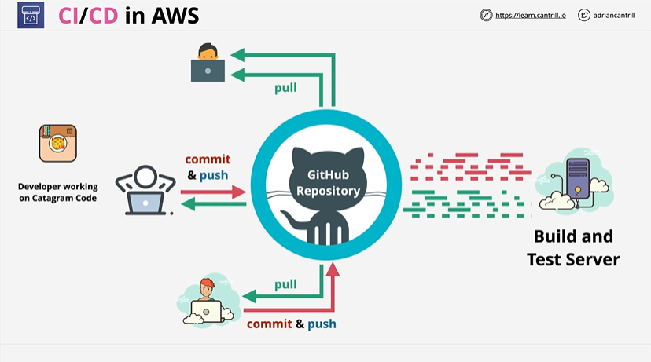
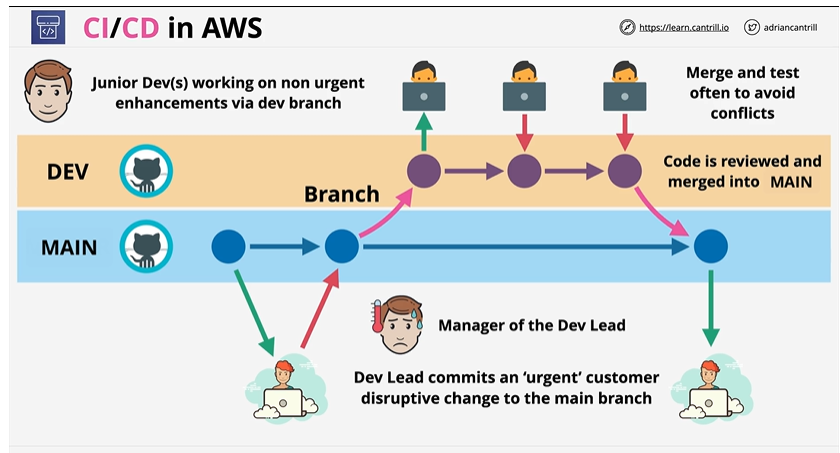
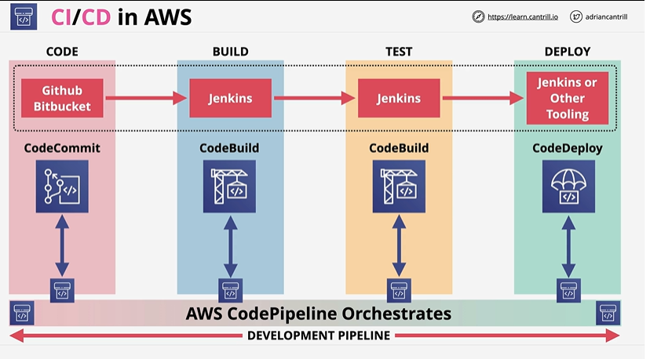
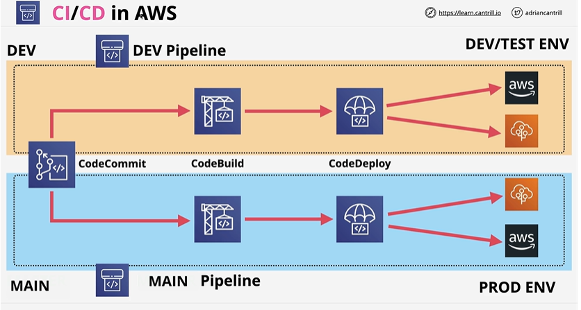
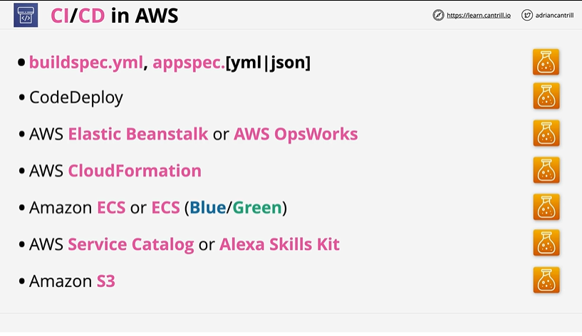

# ⭐ **CI/CD using AWS code**

1. **Developers commit & push code** to a shared GitHub repository after making changes.
2. **Other developers pull updates** from GitHub to stay synchronized with the latest code.
3. **Each push triggers an automated Build & Test process**, ensuring code compiles and passes tests.
4. This creates a **continuous integration workflow**, forming the foundation for full CI/CD in AWS.

# ⭐ **CI/CD in AWS – Branching Workflow **

- Junior developers work on **non-urgent features** in the **DEV branch**, contributing incremental enhancements
- Changes in DEV are **merged and tested frequently** to avoid merge conflicts and maintain code quality
- After review, stable DEV changes are merged into the **MAIN branch**, which represents production-ready code
- The Dev Lead may commit **urgent, high-priority fixes** directly to MAIN to address customer-impacting issues quickly
- Managers oversee and coordinate the flow between branches to ensure stable production while allowing ongoing development
- This branching model supports smooth CI/CD pipelines in AWS services like **CodeCommit, CodeBuild, CodeDeploy, and CodePipeline**
---

# ⭐ **CI/CD in AWS – CodePipeline Orchestration **

- AWS CI/CD commonly integrates with external source providers like **GitHub** and **Bitbucket**, or AWS-native **CodeCommit**
- **CodePipeline** orchestrates the entire CI/CD lifecycle across **CODE → BUILD → TEST → DEPLOY** stages
- The **Build** and **Test** stages can use AWS-native **CodeBuild** or external tools like **Jenkins**
- The **Deploy** stage can be powered by **CodeDeploy** or other third-party deployment tools (e.g., Jenkins, custom scripts)
- CodePipeline automatically triggers each stage based on source changes, ensuring smooth and repeatable delivery flows
- The pipeline supports hybrid setups: AWS-native tools (CodeCommit, CodeBuild, CodeDeploy) or external CI/CD engines like Jenkins

---
# ⭐ **CI/CD in AWS – DEV Pipeline & MAIN Pipeline **

- Separate pipelines for **DEV** and **MAIN** branches allow safe development and stable production deployments
- The **DEV pipeline** (triggered by DEV branch commits) runs through CodeCommit → CodeBuild → CodeDeploy and deploys to **DEV/TEST environments**
- Developers can iterate quickly in DEV, with deployments targeting non-production infrastructure (e.g., EB Dev/QA, EC2 Dev, Lambda Dev)
- The **MAIN pipeline** (triggered by merges into MAIN) follows the same stages but deploys to **PROD environments**
- This separation ensures production stability while enabling frequent, safe development and testing cycles
- CodeCommit acts as a shared source repository, while CodePipeline orchestrates both DEV and MAIN pipelines independently
---

# ⭐ **CI/CD in AWS – Key Services & Files**

- **buildspec.yml** and **appspec.yml/json** define build and deployment instructions for CodeBuild and CodeDeploy
- **CodeDeploy** handles automated deployments to EC2, ECS, Lambda, and on-premises servers
- **Elastic Beanstalk** and **OpsWorks** can be deployment targets within a CI/CD pipeline
- **CloudFormation** enables infrastructure-as-code deployments as part of the pipeline
- **Amazon ECS**, including **ECS Blue/Green** with CodeDeploy, supports containerized CI/CD workflows
- **AWS Service Catalog** and **Alexa Skills Kit** can also participate in automated CI/CD processes
- **Amazon S3** is commonly used to store artifacts, build outputs, and versioned deployment packages
---

