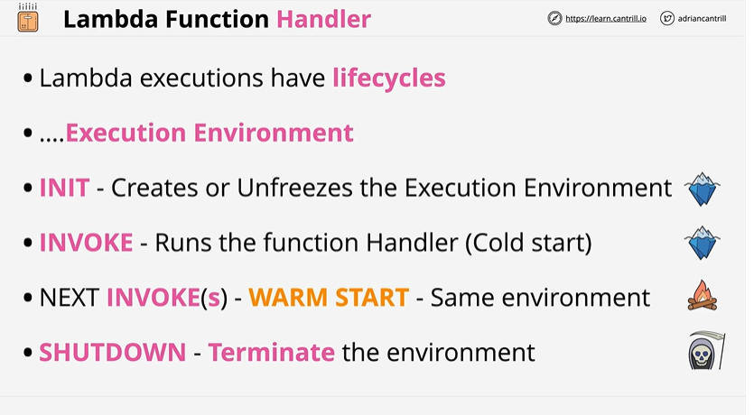
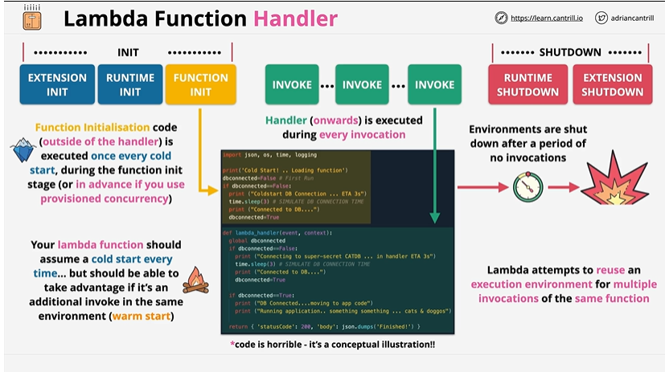

# Lambda Function Handler -1 

## Overview

1. It is a FAAS.
2. When run - it executes in an execution envrionment.
3. Lifecyle - **INIT, INVOKE : Cold start, NEXT INVOKE(S): Warm start (same environment), Shutdown(Terminate) : If environment is not run**

## Detailed Architecture

Between INIT and SHUTDOWN , lies INVOKE, which is responsible for invoking Lambda. Handler or the Invoke handles most of the logic. **Function initialization code is run just once** during the initialization phase whereas the handler function runs everytime the lambda function is invoked. Lambda attempts to reuse the same execution environment for multiple invocation of same function. If the execution envrionment is shut down due to inactivity then to turn it on , it requires a cold start(time consuming). 

> Tip : Anything that is aimed to be reused should be put in the function initialization section

## References 

[Lambda-runtime-context](https://docs.aws.amazon.com/lambda/latest/dg/lambda-runtime-environment.html)