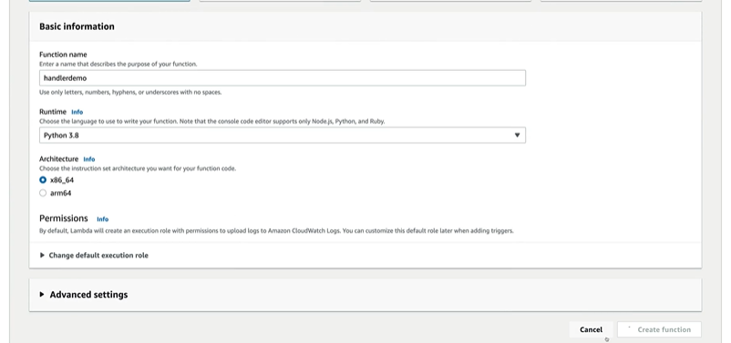
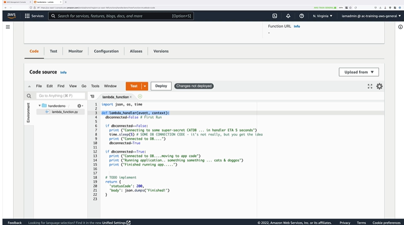
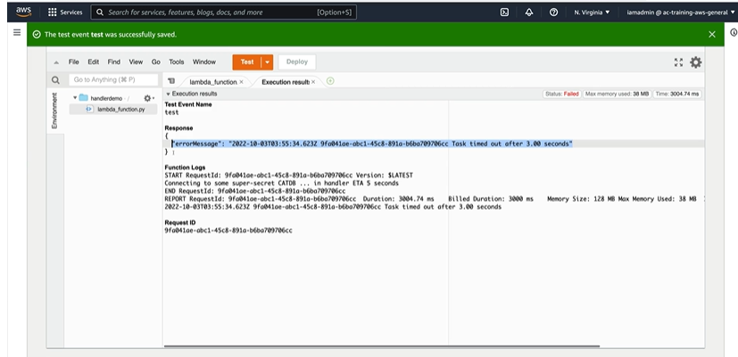
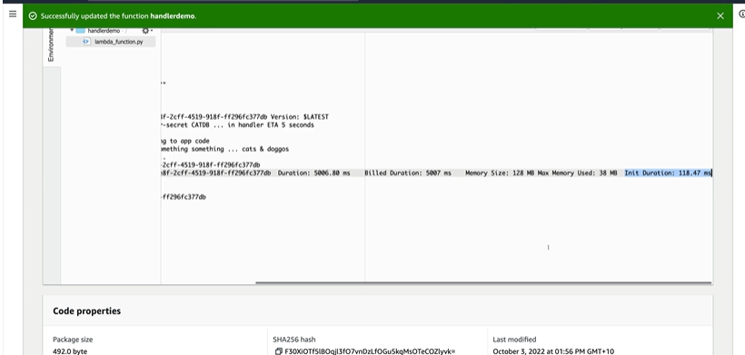
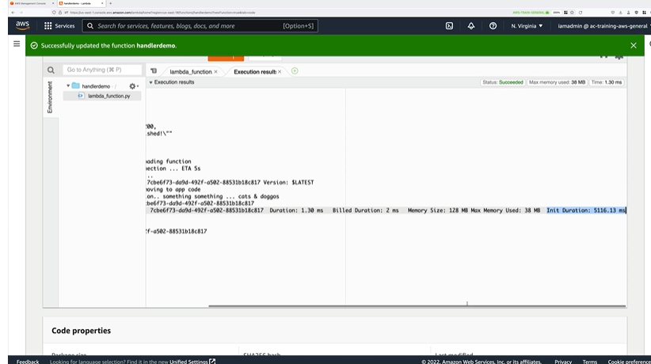

# Lambda Function Handler -2

## Demo
1. Navigate to Lambda -> Function

2. Lambda function is created.
3. Paste the code from [version1.py](Code/version1.py) into the code source

4. Click on Deploy and Test.
5. Might return an error since the default execution limit on lambda of 3 secs

6. To fix , go to configuration tab -> general configuration -> edit -> update the timeout to 1 min and 3 secs
7. Click on test again
8. See INIT time and INVOKE time

9. If invoked again, the INIT time won't be there
10. Put in the [version2.py](Code/version2.py) into the code source and repeat.
11. Deploy and test
12. Notice the INIT and Duration and Billed Duration.

13. Rerun the check the timings.

> The invoker function is placed within lambda_handler. This comes from under the runtime settings -> handler field i.e, lambda_function, lambda_handler.