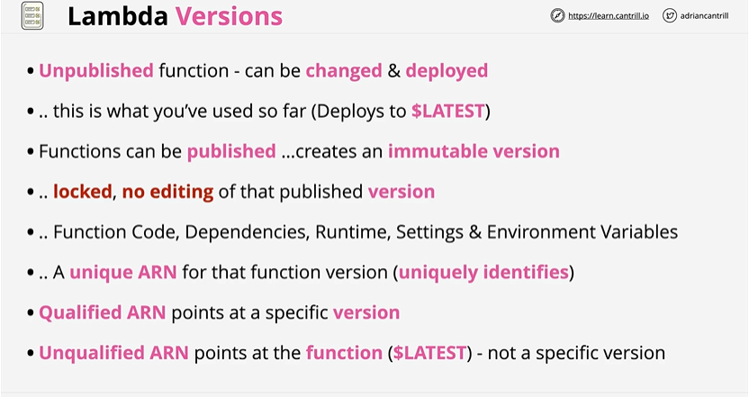

# Lambda Versions

## Overview

You can use versions to manage the deployment of your functions. For example, you can publish a new version of a function for beta testing without affecting users of the stable production version. Lambda creates a new version of your function each time that you publish the function. The new version is a copy of the unpublished version of the function.

A function version includes the following information:

1. The function code and all associated dependencies.
2. The Lambda runtime that invokes the function.
3. All of the function settings, including the environment variables.
4. A unique Amazon Resource Name (ARN) to identify the specific version of the function.

> Unique Amazon Resource Name (ARN) is known as the Qualified ARN.

