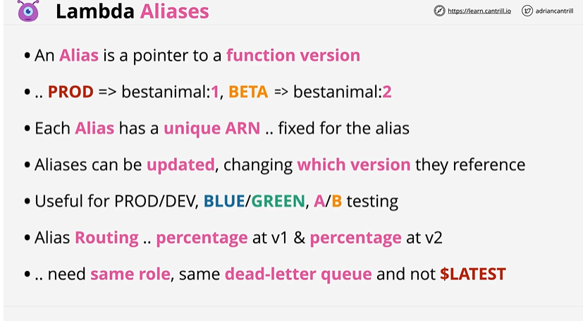

# Lambda Aliases

## Overview

It is a pointer to a function version. Can create aliases to point to qualified ARN. Can be used for deployment as well.

## Architecture

Alias are assigned to Qualified unique ARN. PROD points to v1, TEST points to v2. API gateway initially points 100% of the requests to PROD, however it can be configured to redirect few of the requests to TEST using Aliases. For example PROD alias pointing to v2. It could also be configured to route 90% of the traffic to v1 and 10% to v2.
