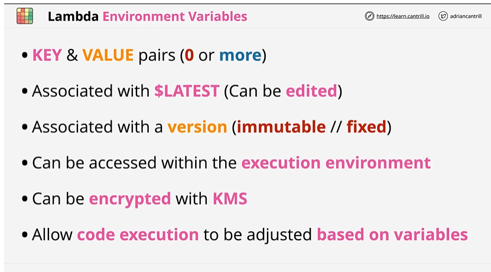

# Lambda Environment Variables

## Overview


Accepts Key & Value pairs(0 or more).By default associated with the $Latest(Editable version of lambda function). Associated version published from latest would also contain this lambda environment variables(immutable/fixed). 

## Walkthrough

# ✅ **1. Using AWS Console**

### **Steps**

1. Go to **AWS Console → Lambda**.
2. Open your Lambda function.
3. In the left panel, select **Configuration**.
4. Scroll down to **Environment variables**.
5. Click **Edit** → **Add environment variable**.
6. Add your key–value pairs (e.g., `ENV`, `PROD`).
7. Click **Save**.


## **Python**

```python
import os
def lambda_hanlder(event, context):
    print (os.environ["ENV"])
```

Python code above would show the environment variable associated.

---

# ✅ **2. Using AWS CLI**

### **Set environment variables**

```bash
aws lambda update-function-configuration \
  --function-name MyLambdaFunction \
  --environment "Variables={DB_HOST=mydb.example.com,ENV=prod}"
```

### **Add or update only one variable without overwriting others**

First fetch existing variables:

```bash
aws lambda get-function-configuration \
  --function-name MyLambdaFunction
```

Then merge and update.

---

# ✅ **3. Using AWS SAM (Serverless Application Model)**

```yaml
Resources:
  MyLambdaFunction:
    Type: AWS::Serverless::Function
    Properties:
      Handler: app.handler
      Runtime: nodejs18.x
      Environment:
        Variables:
          ENV: "prod"
          BUCKET: "my-app-bucket"
```

---

# ✅ **4. Using AWS CloudFormation**

```yaml
Resources:
  LambdaFunction:
    Type: AWS::Lambda::Function
    Properties:
      Handler: index.handler
      Runtime: python3.10
      Environment:
        Variables:
          LOG_LEVEL: "info"
          TABLE_NAME: "UsersTable"
```

---

# ✅ **5. Using Terraform**

```hcl
resource "aws_lambda_function" "my_lambda" {
  function_name = "my-func"
  handler       = "index.handler"
  runtime       = "nodejs18.x"

  environment {
    variables = {
      ENV     = "prod"
      API_KEY = "123456"
    }
  }
}
```

---

# 🔐 **Encryption (Optional but Recommended)**

Lambda environment variables are encrypted at rest with AWS-managed KMS key by default.
To use your own KMS key:

**Console:**
Environment variables → Edit → Enable **KMS key**.

**CLI:**

```bash
aws lambda update-function-configuration \
  --function-name MyLambdaFunction \
  --kms-key-arn arn:aws:kms:region:acct:key/your-key-id
```

---

# 🔍 **Accessing Environment Variables in Code**

## **Node.js**

```js
const env = process.env.ENV;
```

## **Python**

```python
import os
env = os.environ["ENV"]
```

## Reference
[Lambda-Environment-Variables](https://docs.aws.amazon.com/lambda/latest/dg/configuration-envvars.html#configuration-envvars-samples)
