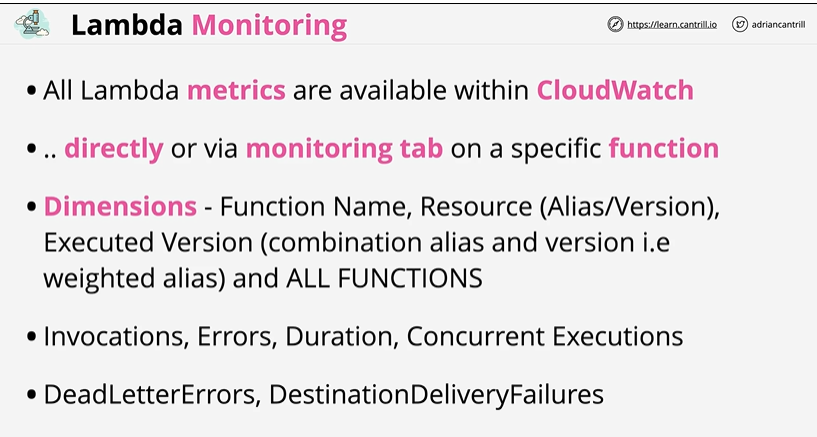
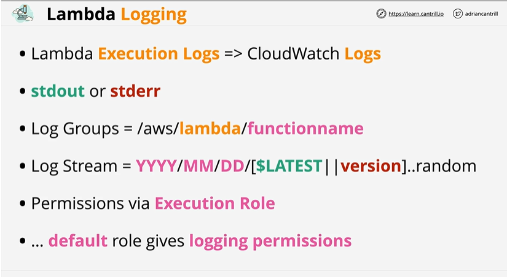
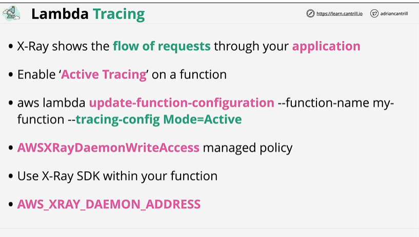

# Lambda Monitoring, Logging, Tracing

## Overview

Monitoring - focuses on metrics which means telemetry data and lambda injects all data or all functions into cloudwatch.


Logging - lambda sends its execution log through to cloudwatch logs. stdout or stderr would be logged. log groups created which would be using log stream. Permission provided via execution role.


Tracing - X ray provides the visibility of the flow of requests through your application(those using API gateway or lambda). Enable 'Active Tracing' on a lambda function(this makes XRay available in the lambda execution environment). Can also be enabled via the CLI. To use Xray within a lambda function , permission is required which gets delivered via execution role. Need to ensure that via managed policy AWSXRayDaemonWriteAccess is provided as part of the execution role. XRay then could be used in execution environment. 
> AWS_XRAY_DAEMON_ADDRESS - Environment variable - provide details about the Xray running in execution environment.

# 🚀 **1. ENABLE MONITORING (CloudWatch Metrics)**

### **CloudWatch Monitoring provides:**

* CPU, Network, Memory, Disk (for EC2 & Containers)
* Invocation counts, duration, errors (for Lambda)
* API Gateway latency, 4xx/5xx errors

---

## **1.1 Enable Monitoring for EC2**

✓ EC2 instances automatically send basic metrics every 5 minutes.
If you want **detailed monitoring (1-minute metrics)**:

**Steps**

1. Go to **AWS Console → EC2 → Instances**.
2. Select the instance.
3. Choose **Actions → Monitor and troubleshoot → Manage CloudWatch monitoring**.
4. Enable **Detailed Monitoring**.
5. Click **Save**.

---

## **1.2 Enable Monitoring for Lambda**

Lambda metrics are automatically sent to CloudWatch:

* Invocations
* Errors
* Duration
* Throttles

No setup required.

To view:

1. Open **Lambda → Monitor** tab.
2. View metrics dashboard, traces, logs.

---

## **1.3 Enable Monitoring for API Gateway**

1. Go to **API Gateway**.
2. Select your API.
3. Choose **Stages**.
4. Select your stage (e.g., `prod`).
5. Under **Logs/Tracing**, enable:

    * ✔ CloudWatch Metrics
    * ✔ Detailed Metrics

---

# 📜 **2. ENABLE LOGGING (CloudWatch Logs)**

CloudWatch Logs store logging output from AWS services.

---

## **2.1 Enable Logging for Lambda**

Logging is automatic if your Lambda has the correct IAM role:

### **Required IAM permissions**

Your Lambda execution role must have:

```json
{
  "Effect": "Allow",
  "Action": [
    "logs:CreateLogGroup",
    "logs:CreateLogStream",
    "logs:PutLogEvents"
  ],
  "Resource": "*"
}
```

### **Steps to View Logs**

1. Open **Lambda → Monitor → Logs**.
2. This links to **CloudWatch → Log Groups → /aws/lambda/<function-name>**.

---

## **2.2 Enable Logging for API Gateway**

1. Go to **API Gateway → Stages → prod**.
2. Under **Logs/Tracing**, enable:

    * ✔ Enable CloudWatch Logs
    * ✔ Log level (ERROR / INFO)
    * ✔ Full Request/Response Logs (optional)

API Gateway will automatically create log groups.

---

## **2.3 Enable Logging for EC2 (CloudWatch Agent)**

EC2 does NOT automatically send OS-level logs.

You must install the CloudWatch Agent:

**Steps**

1. SSH into EC2.
2. Install CloudWatch Agent (Amazon Linux example):

   ```bash
   sudo yum install amazon-cloudwatch-agent -y
   ```
3. Configure:

   ```bash
   sudo /opt/aws/amazon-cloudwatch-agent/bin/amazon-cloudwatch-agent-config-wizard
   ```
4. Start agent:

   ```bash
   sudo systemctl start amazon-cloudwatch-agent
   ```

---

# 🔍 **3. ENABLE TRACING (AWS X-Ray)**

X-Ray helps visualize request flows across distributed systems (API Gateway → Lambda → DynamoDB).

---

## **3.1 Enable Tracing for Lambda**

1. Open **Lambda**.
2. Go to **Configuration → Monitoring and operations tools**.
3. Under **X-Ray**, enable:

    * ✔ Active tracing
4. Save.

Lambda now sends traces to X-Ray.

---

## **3.2 Enable Tracing for API Gateway**

1. Open **API Gateway**.
2. Go to **Stages → prod**.
3. Under **Logs/Tracing**:

    * ✔ Enable X-Ray Tracing
4. Save.

---

## **3.3 Enable Tracing for ECS / EC2 / EKS**

Install the **X-Ray Daemon** or Sidecar.

**EC2 Example**

```bash
sudo yum install -y xray
sudo systemctl enable xray
sudo systemctl start xray
```

This allows applications to send trace segments to X-Ray.

---

# 🔑 Summary Table

| AWS Component   | Monitoring                   | Logging                  | Tracing                 |
| --------------- | ---------------------------- | ------------------------ | ----------------------- |
| **Lambda**      | Auto-enabled                 | Auto (with IAM role)     | Enable “Active Tracing” |
| **API Gateway** | Enable per stage             | Enable per stage         | Enable X-Ray            |
| **EC2**         | Optional Detailed Monitoring | Install CloudWatch Agent | Install X-Ray Daemon    |
| **ECS/EKS**     | CloudWatch Metrics           | Container Insights       | X-Ray Sidecar           |

---

