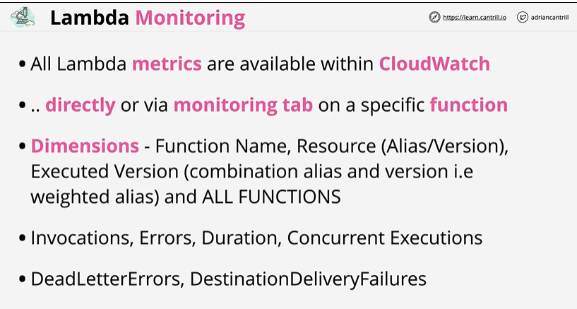
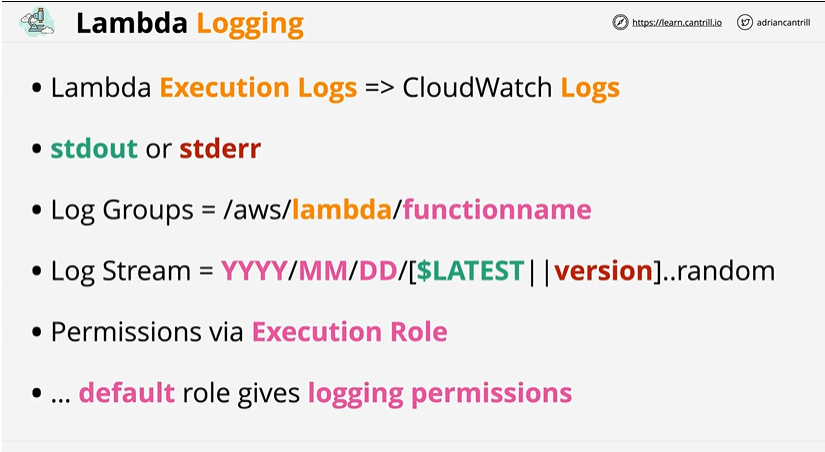
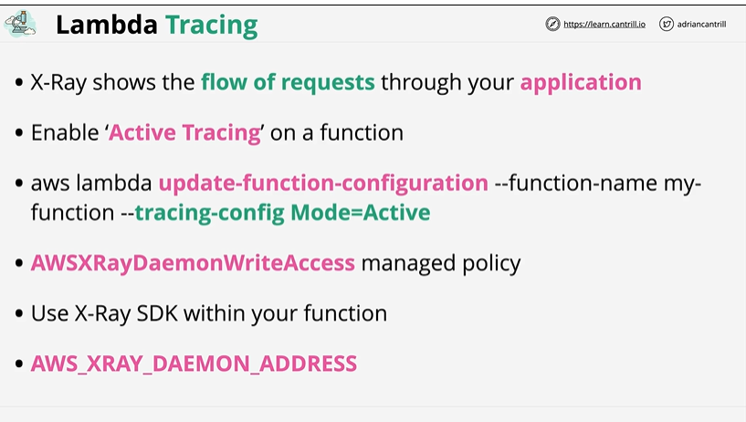

# Lambda Monitoring, Logging, Tracing

## Overview

Monitoring - focuses on metrics which means telemetry data and lambda injects all data or all functions into cloudwatch.

Logging - lambda sends its execution log through to cloudwatch logs. stdout or stderr would be logged. log groups created which would be using log stream. Permission provided via execution role.

Tracing - X ray provides the visibility of the flow of requests through your application(those using API gateway or lambda). Enable 'Active Tracing' on a lambda function(this makes XRay available in the lambda execution environment). Can also be enabled via the CLI. To use Xray within a lambda function , permission is required which gets delivered via execution role. Need to ensure that via managed policy AWSXRayDaemonWriteAccess is provided as part of the execution role. XRay then could be used in execution environment. 
> AWS_XRAY_DAEMON_ADDRESS - Environment variable - provide details about the Xray running in execution environment.