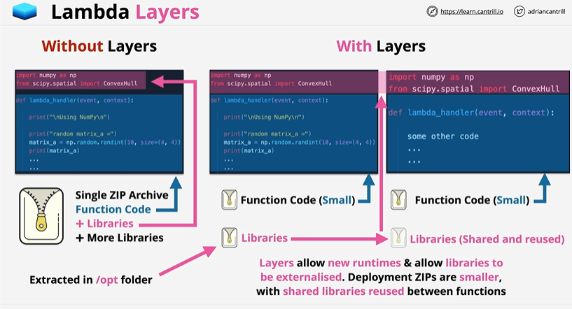

# Lambda Layers

## Overview

A layer is a .zip file archive that contains libraries, a custom runtime, or other dependencies. With layers, you can use libraries in your function without needing to include them in your deployment package.



## Demo

# **AWS Lambda Layers — Step-by-Step Configuration Guide**

---
# ✅ **PART 0 — Create a Lambda Function**

Create a lambda function 

```python
import numpy as np
from scipy.spatial import ConvexHull

def lambda_handler(event, context):

    print("\nUsing NumPy\n")

    print("random matrix_a =")
    matrix_a = np.random.randint(10, size=(4, 4))
    print(matrix_a)

    print("random matrix_b =")
    matrix_b = np.random.randint(10, size=(4, 4))
    print(matrix_b)

    print("matrix_a * matrix_b = ")
    print(matrix_a.dot(matrix_b))
    print("\nUsing SciPy\n")

    num_points = 10
    print(num_points, "random points:")
    points = np.random.rand(num_points, 2)
    for i, point in enumerate(points):
        print(i, '->', point)

    hull = ConvexHull(points)
    print("The smallest convex set containing all",
        num_points, "points has", len(hull.simplices),
        "sides,\nconnecting points:")
    for simplex in hull.simplices:
        print(simplex[0], '<->', simplex[1])
```

# ✅ **PART 1 — Create a Lambda Layer**

## **Step 1: Prepare the Layer Content**

A Lambda layer is just a ZIP file with libraries, binaries, or shared code.

### **For Python**

```
python/
    lib/
       python3.12/
           site-packages/
               <packages>
```
---

## **Step 2: Go to the Lambda Layers Console**

AWS Console → **Lambda** → Left menu → **Layers** → **Create layer**

## **Step 3: Add the Layer**

Scroll down → **Layers** → **Add a layer**

Options available:

* **Custom layers** (your own)
* **AWS provided layers** ✅ (Choose this)
* **Layers from ARN**

---

## **Step 4: Choose the Version**

Select:

* AWS Layers
* Layer version

Click **Add**.

Your layer is now attached to your Lambda function.

---


