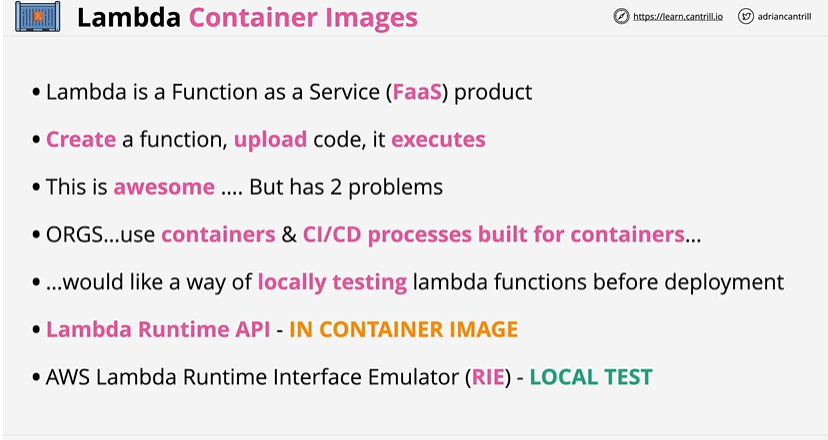
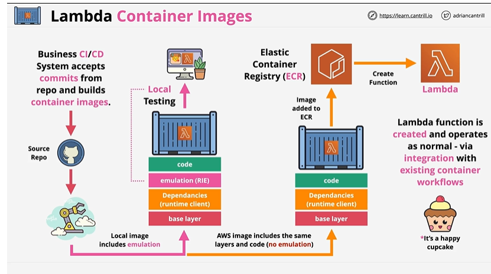

# Lambda Container Images

## Overview

You can package your code and dependencies as a container image using tools such as the Docker command line interface (CLI). You can then upload the image to your container registry hosted on Amazon Elastic Container Registry (Amazon ECR).

AWS provides a set of open-source base images that you can use to build the container image for your function code. You can also use alternative base images from other container registries. AWS also provides an open-source runtime client that you add to your alternative base image to make it compatible with the Lambda service.

Additionally, AWS provides a runtime interface emulator for you to test your functions locally using tools such as the Docker CLI.

## Detailed Architecture

