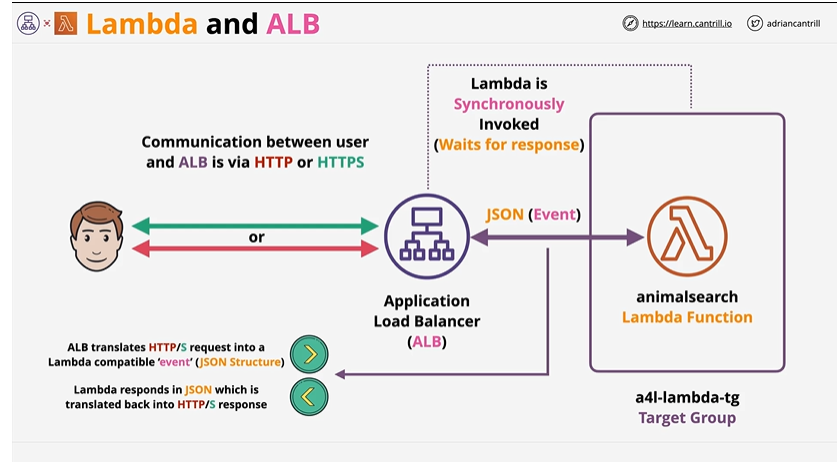
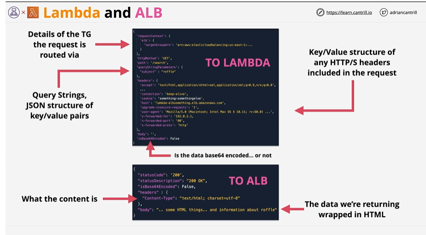
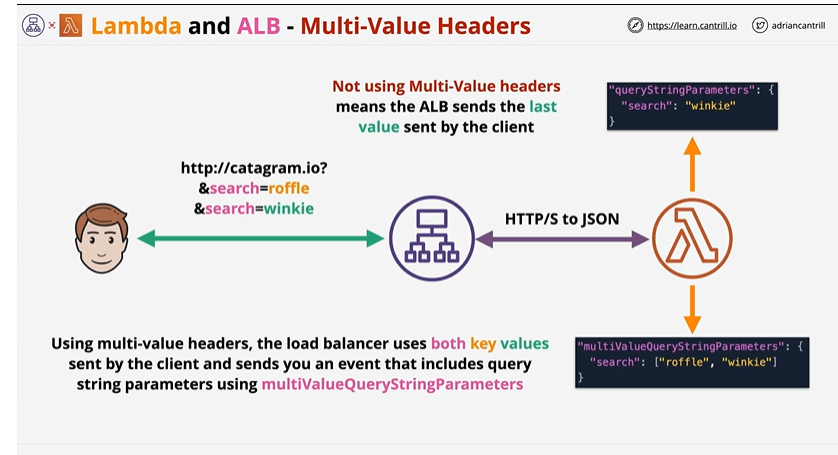

# Lambda & Application Load Balancer

## Overview

You can use a Lambda function to process requests from an Application Load Balancer. Elastic Load Balancing supports Lambda functions as a target for an Application Load Balancer. Use load balancer rules to route HTTP requests to a function, based on path or header values. Process the request and return an HTTP response from your Lambda function.

Elastic Load Balancing invokes your Lambda function synchronously with an event that contains the request body and metadata.

## Detailed Architecture

animalsearch function lets the user search for an animal via the name or id and retrieves information about those animals. ALB configured with the target group containing lambda function, when it receives a request from the client side, it synchronously invokes a request from the ALB. This means it invokes the lambda function passing in some data and waits for the response. ALB passes a json structure into the lambda function inside the event structure which every lambda function receives. Lambda function just needs to interpret that and generate response.

Visually interaction looks like the following - 

Multi Value header - 

