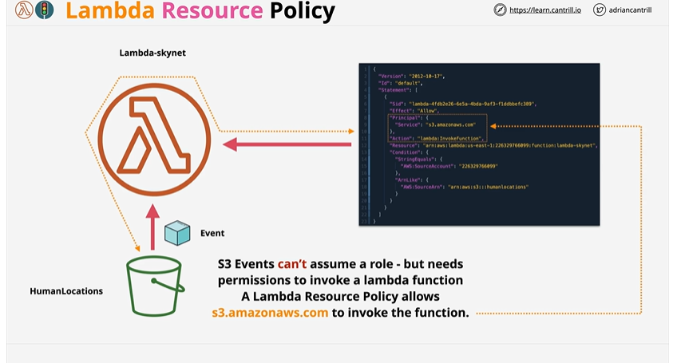
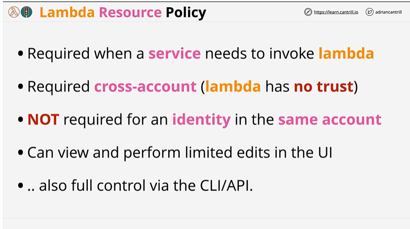

# Lambda Resource Policy

## Overview
Lambda resource policies one of the two main ways of controlling access to lambda functions.

## Detailed Architecture

1. **Same account access(Account A)** - IAM user can invoke the lambda function if it is granted access via the identity policy. Also, if the lambda function provides a resource policy for it to access it then also the user will be able to invoke the lambda function.
2. **Cross account access(Account A - Account B)** - Requires Identity Policy enabled (OUT) And Resource Policy(IN).

## Steps :

## Summary 

