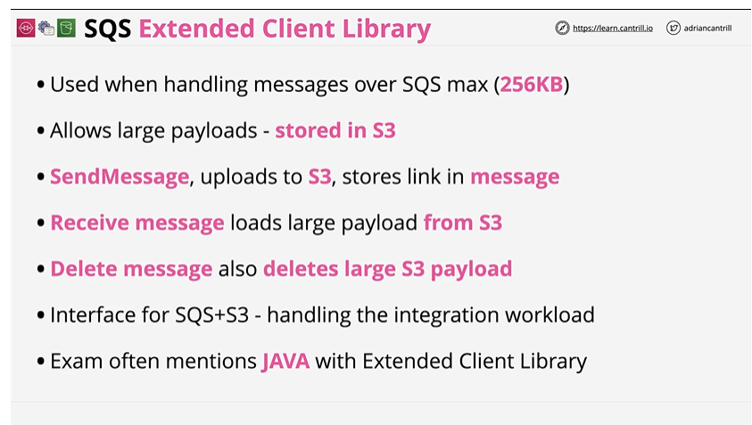

# SQS Extended Client Library

## Overview

Used when handling messages over SQS larger then 256KB

## Key Concepts

- Has hard limit of being tied to S3 bucket.
- Can send messages worth the size of 2GB.

## References 
https://docs.aws.amazon.com/AWSSimpleQueueService/latest/SQSDeveloperGuide/sqs-s3-messages.html