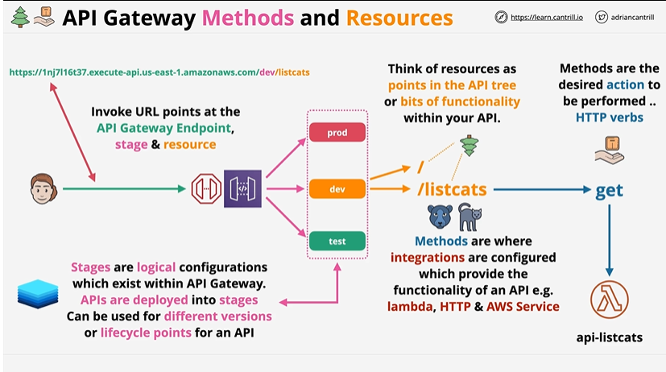
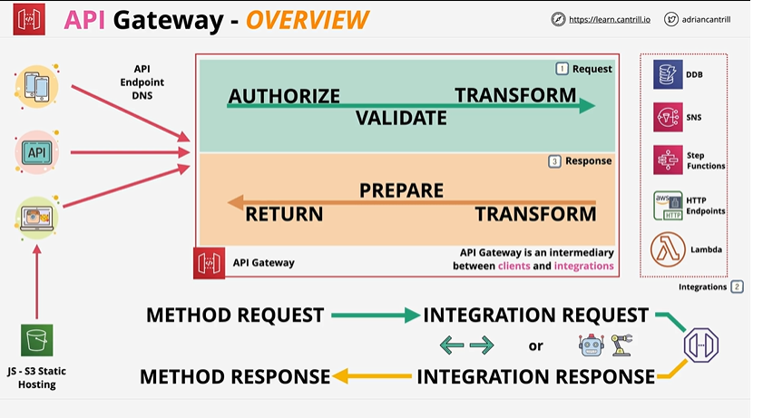
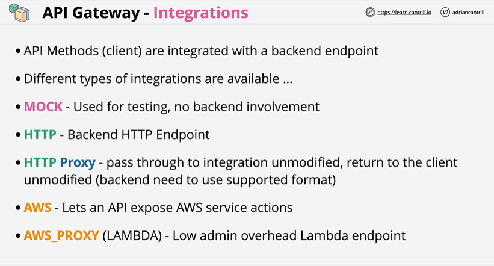
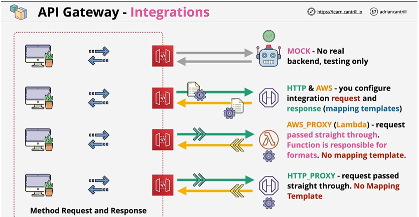
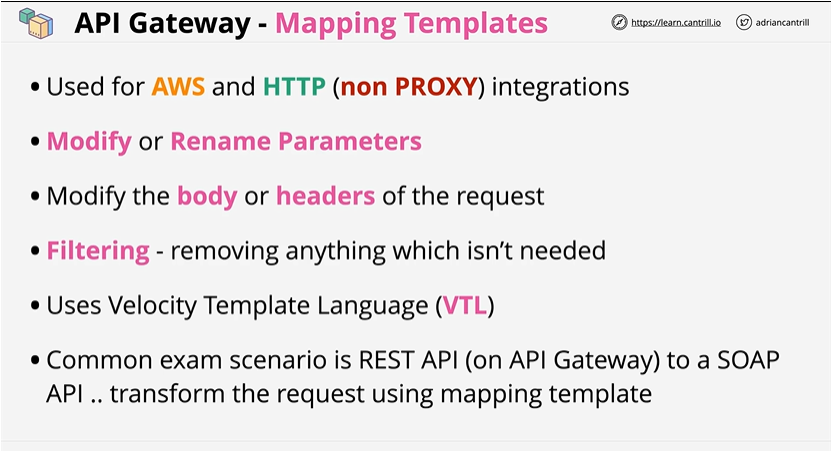

## ✅ **1. What API Gateway Is**

Let's say that we provision an API using API gateway in doing so we picked a type(might be a REST API or a web socket API). Now , if it's private then it's only available in VPC, or edge optimised that is deployed using cloudfront or is regional.

* Fully managed service to **create, publish, monitor, secure APIs** at any scale.
* Supports **REST APIs, HTTP APIs, WebSocket APIs**.

---
## ⭐ **API Gateway – Methods & Resources**

1️⃣ **Resources = URL paths / functionality units**

* Each resource (e.g., `/listcats`) represents a specific endpoint or feature in your API.
* They form the *API tree structure* (e.g., `/`, `/users`, `/products`).

---

2️⃣ **Methods = actions on a resource (HTTP verbs)**

* Methods like **GET, POST, PUT, DELETE** define *what action* is performed on that resource.
* Behind each method lies the **integration** (Lambda, HTTP, AWS Service).

---

3️⃣ **Stages = versions or environments of the API**

* Examples: **dev**, **test**, **prod**.
* Deployments go to stages; each stage is a *logical configuration* with its own URL and settings.

---

4️⃣ **Invoke URL = Endpoint + Stage + Resource**

* The final URL a client calls is built like:
  **`https://api-id.execute-api.region.amazonaws.com/dev/listcats`**
* This URL maps the request to the correct stage → resource → method → integration.

---

## ✅ **3. Integrations**

1️⃣ **API Gateway acts as an intermediary**
It sits between **clients** (mobile, web, apps) and **backend integrations** (Lambda, HTTP endpoints, AWS services like DynamoDB, SNS, Step Functions).

---

2️⃣ **Incoming requests go through AUTHORIZATION → VALIDATION → TRANSFORMATION**
Before forwarding the request to the backend, API Gateway can:

* **Authorize** (IAM, Cognito, Lambda Authorizer)
* **Validate** parameters or payloads
* **Transform** using mapping templates (VTL)

---

3️⃣ **Responses are PREPARED → TRANSFORMED → RETURNED to client**
API Gateway can modify backend responses, add headers, change status codes, or reshape JSON before sending it back to the caller.

---

4️⃣ **Two major flow pairs: Method vs Integration**

* **Method Request ↔ Method Response** → what the *client* sees
* **Integration Request ↔ Integration Response** → how API Gateway talks to the *backend*
  Mapping templates allow transformation between these two pipelines.

NOTE : Integration Request (API Gateway → Backend)
- Integration Request Proxying means:
- API Gateway passes the entire request directly to the backend
- No transformations
- No custom mapping templates
- No need to manually construct payloads
- This is known as Lambda Proxy Integration or HTTP Proxy Integration.

### **Lambda Integration**

* Most common in DVA exam.
* Payload format: **Lambda Proxy Integration** (recommended).
* Your Lambda handles:

    * HTTP status codes
    * Body
    * Headers

### **AWS Service Integration**

# ⭐ **API Gateway – Integrations**

1️⃣ **MOCK Integration – no backend**

* Used for **testing** and **prototyping**.
* API Gateway returns a pre-configured response.
* No real backend resource exists.

---

2️⃣ **HTTP & AWS Integration – you control the mapping**

* You manually configure **Integration Request** and **Integration Response**.
* Supports calling:

    * HTTP endpoints
    * AWS services (DynamoDB, S3, SNS, etc.)
* Requires **mapping templates (VTL)** to transform request/response.

---

3️⃣ **AWS_PROXY (Lambda Proxy) – full pass-through**

* The **entire request** is passed to the Lambda function unchanged.
* Lambda must handle:

    * Status codes
    * Headers
    * Body formatting
* **No mapping templates** needed – simplest and most common for serverless apps.

---

4️⃣ **HTTP_PROXY – full passthrough to external HTTP endpoint**

* API Gateway forwards the request “as-is” to the target HTTP service.
* The backend service determines the response.
* Again, **no mapping templates** used.

## ✅ **4. Authentication & Authorization**

### **IAM Authorization**

* Used for internal service-to-service API calls.
* Uses **SigV4 signing**.

### **Cognito Authorizer**

* For securing APIs with **user pools** (tokens: ID token/Access token).

### **Lambda Authorizer (Custom Authorizer)**

* Lambda function checks auth logic and returns allow/deny.
* Useful for:

    * API key validation
    * Custom JWT systems
    * Complex multi-tenant logic

---

## ✅ **5. API Keys & Usage Plans**

* API Keys **only identify callers** (not auth mechanism).
* Used to:

    * Rate-limit
    * Meter usage
    * Throttle per API key
* Must be attached to **usage plan**.
* Require **"API Key Required = true"** in method settings.

---

## ✅ **6. Throttling**

Two levels:

1. **Account-level throttling** (global to API Gateway).
2. **Per-API or Per-Method throttling**.

Burst capacity is handled automatically by API Gateway.

---

## ✅ **7. Caching**

* Enabled **per stage**.
* Reduces cost by decreasing Lambda invocations.
* TTL configurable.
* Cache can be encrypted.
* Very important for performance questions.

---

## ✅ **8. Stages & Deployment**

* After updating an API, **must deploy it to a stage**.
* Stages have:

    * Logging settings
    * Throttling
    * Caching
    * Variables (used in mapping templates)

---

## ✅ **9. Mapping Templates (VTL)**

Used for:

* Transforming **request** before reaching backend
* Transforming **response** before returning to client
* Adding headers, modifying inputs, etc.

Exam tip:
**REST APIs use mapping templates; HTTP APIs don’t support full VTL.**

---

## ✅ **10. Cross-Origin Resource Sharing (CORS)**

You must enable CORS when API is called from browsers.
Includes enabling:

* `OPTIONS` method
* Required headers

HTTP APIs support **one-click CORS** configuration.

---

## ✅ **11. Logging & Monitoring**

### **CloudWatch Logs**

* Must enable **Execution Logging** at stage level.
* Can log:

    * Request & response
    * Latency
    * Integration errors

### **X-Ray Tracing**

* Supports end-to-end tracing for API Gateway + Lambda.

---

## ✅ **12. API Gateway with VPC**

### **Private API**

* Accessible only within VPC using **VPC Endpoint (Interface Endpoint)**.

### **VPC Link**

* Connects API Gateway to **private resources** behind NLB.
* Works with REST and HTTP APIs.

---

## ✅ **13. Deployment Best Practices**

* Use **Canary deployments** for staged rollout.
* Canary % defines:

    * Traffic split
    * Metrics
    * Logging

---

## 🔥 **14. Common Exam Scenarios (DVA-C02 Patterns)**

### **Scenario 1:**

*You need cheapest, fastest API for Lambda invocation.*
→ **HTTP API + Lambda proxy integration**

### **Scenario 2:**

*You need API keys & usage plans.*
→ **REST API**

### **Scenario 3:**

*Custom authentication based on database lookup.*
→ **Lambda Authorizer**

### **Scenario 4:**

*Internal API accessible only from VPC.*
→ **Private API + VPC Endpoint**

### **Scenario 5:**

*Backend is an on-premise or VPC server, not internet-facing.*
→ **REST API + VPC Link + NLB**

### **Scenario 6:**

*Client expects custom status codes and headers.*
→ Use **Lambda Proxy Integration** or **Mapping Templates**.

---
