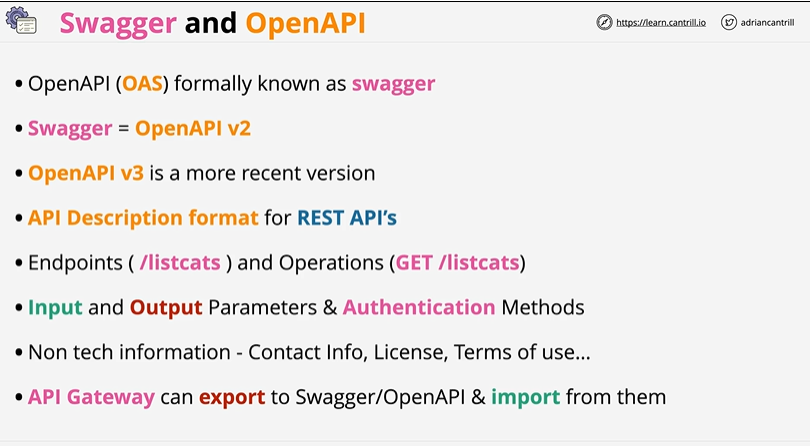

# ⭐ **Swagger & OpenAPI**


1️⃣ **Swagger is the old name; OpenAPI is the standard**

* OpenAPI Specification (**OAS**) used to be called **Swagger**.
* Swagger = **OpenAPI v2**, while **OpenAPI v3** is the newer, improved version.

---

2️⃣ **OpenAPI is a description format for REST APIs**
It defines:

* Endpoints (e.g., `/listcats`)
* Operations (`GET`, `POST`, etc.)
* Input/output parameters
* Authentication methods

---

3️⃣ **OpenAPI includes both technical and non-technical API details**
It can document:

* Contact info
* Licensing
* Terms of use
* Metadata about the API

---

4️⃣ **API Gateway supports OpenAPI import and export**

* You can **export** your API Gateway configuration as a Swagger/OpenAPI file.
* You can **import** an OpenAPI definition to build an API quickly.

# ⭐ **How to Set Up Swagger/OpenAPI in AWS API Gateway (Step-by-Step)**

---

# ✔️ **A. IMPORT an OpenAPI/Swagger File into API Gateway**

### **1️⃣ Prepare your OpenAPI or Swagger file**

* Can be **YAML** or **JSON**
* Must follow **OpenAPI v2 (Swagger)** or **OpenAPI v3** syntax.

Example minimal snippet:

```yaml
openapi: 3.0.1
paths:
  /cats:
    get:
      responses:
        '200':
          description: OK
```

---

### **2️⃣ Go to AWS API Gateway Console**

* Open AWS → **API Gateway**
* Click **Create API**

---

### **3️⃣ Choose “Import”**

* Select **REST API**
* Click **Import from OpenAPI**

---

### **4️⃣ Upload or paste your OpenAPI specification**

* Upload file from computer
* Or paste the entire YAML/JSON text

AWS will automatically create:

* Resources
* Methods
* Models
* Documentation remarks (if added)

---

### **5️⃣ Configure Integrations**

Your OpenAPI file may or may not define integrations.

If not:

* Select each method → **Integration Request**
* Add **Lambda**, **HTTP**, or **AWS Service** backend.

---

### **6️⃣ Deploy your API**

* Click **Actions → Deploy API**
* Create a stage (e.g., `dev`)
* Your API is now live.

---

---

# ✔️ **B. EXPORT an API from API Gateway to OpenAPI/Swagger**

### **1️⃣ Open your API in API Gateway**

Choose the REST API you want to export.

---

### **2️⃣ Go to “Stages”**

* Select the stage you want to export (e.g., `dev`)

---

### **3️⃣ Click the “Export” tab**

Available export formats:

* **OpenAPI v3**
* **OpenAPI v2 (Swagger)**
* With or without **API Gateway extensions**

---

### **4️⃣ Choose format**

Export options:

* **OpenAPI 3.0**
* **OpenAPI 3.0 + API Gateway extensions**
* **Swagger (OpenAPI v2)**
* **Swagger + API Gateway extensions**

Extensions store settings like:

* Integrations
* Authorizers
* Throttling
* Models

---

### **5️⃣ Download or copy the file**

Use:

* Download button
* Or copy to clipboard

You can now use it in:

* Postman
* SwaggerHub
* API Gateway re-import
* CI/CD systems

---

---

# ✔️ **C. MOST COMMON EXAM SCENARIO**

**You are given a large team/enterprise that wants consistent API design.**
Solution:
✔ Use **OpenAPI** to define API structure
✔ Store in Git
✔ Use **API Gateway import** to generate APIs
✔ Use **export** to maintain versioned documentation

---

