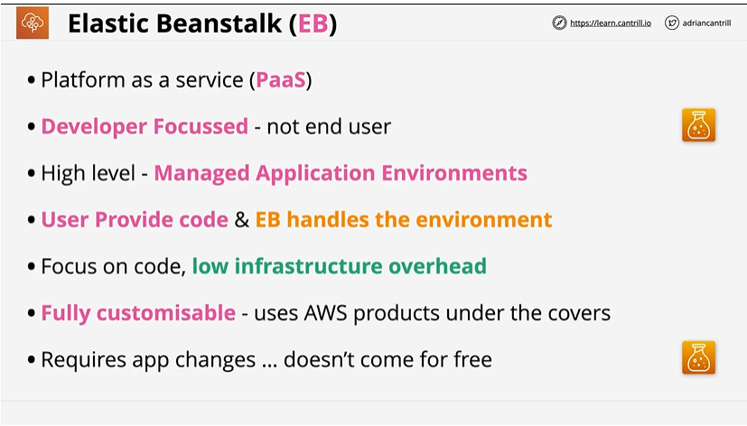
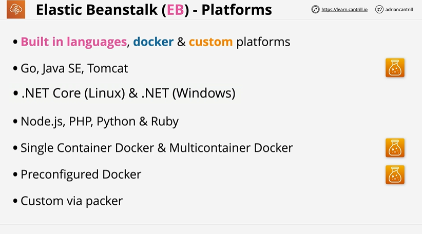
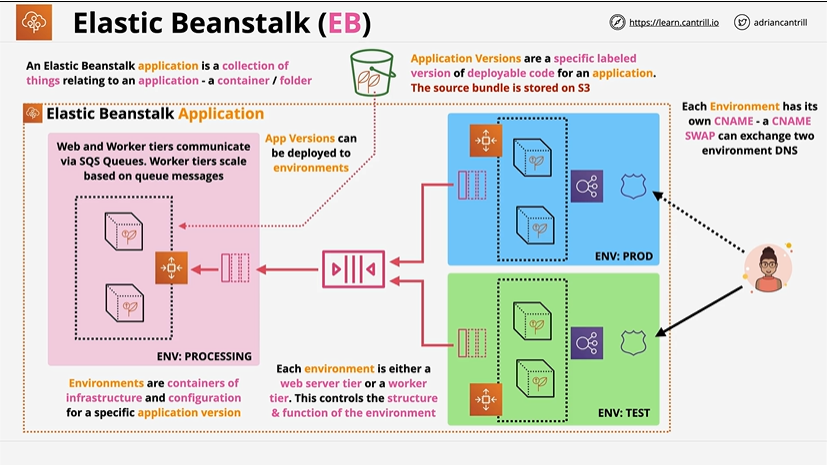
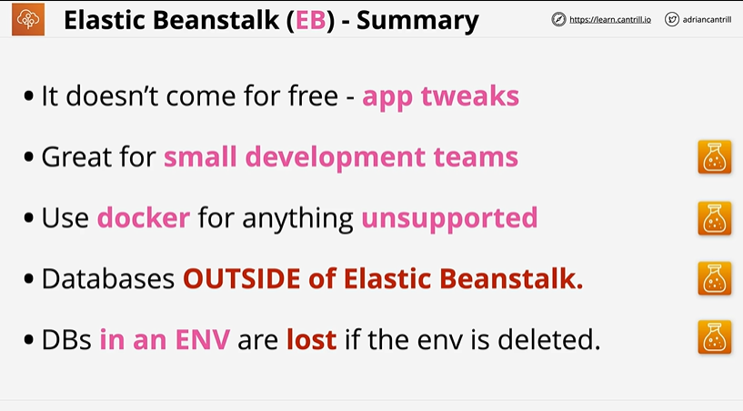

# ⭐ **Elastic Beanstalk (EB)**

- **Platform as a Service (PaaS)**
Elastic Beanstalk provides a **managed application environment** where AWS handles provisioning, scaling, monitoring, and patching.
- **Developer-focused, not end-user focused**
You **upload your application code**, and Elastic Beanstalk automatically deploys it onto AWS infrastructure (EC2, ALB, Auto Scaling).
- **Low infrastructure overhead with full customization**
EB abstracts the infrastructure, but still allows full control — you can adjust EC2, RDS, scaling, load balancers, and configuration files (**.ebextensions**).
- **EB handles environment setup, but apps may need adjustments**
Beanstalk is convenient but **not free of complexity** — your app might require changes to fit the managed environment.

---
# ⭐ **Elastic Beanstalk – Platforms**

1️⃣ **Supports built-in languages, Docker, and custom platforms**
EB provides ready-to-use runtimes plus full flexibility via Docker or custom images.
---

2️⃣ **Wide language support**
Includes:

* Go, Java SE, Tomcat
* .NET Core on Linux, .NET on Windows
* Node.js, PHP, Python, Ruby

---

3️⃣ **Container-based deployments supported**

* **Single-container Docker**
* **Multicontainer Docker (ECS under the hood)**
* **Preconfigured Docker images**

---

4️⃣ **Custom platforms via Packer**
If your application requires something not supported natively, you can build a **custom EB platform** using Packer to define your own AMI/runtime.

---

# ⭐ **Elastic Beanstalk (EB) – Application, Environments & Versions **

- An **Elastic Beanstalk application** is a logical container grouping everything related to one app (versions, configs, environments) - **Application Versions** are specific, labeled deployable bundles of code stored in S3; versions can be deployed to any environment
- EB **Environments** are isolated containers of infrastructure + configuration; each environment is either a **web server tier** or a **worker tier**
- Web and Worker tier environments can communicate via **SQS queues**, with worker tier auto-scaling based on queue depth
- Each environment has its own **CNAME**; EB supports **CNAME swap** to instantly switch DNS between two environments (e.g., blue/green deployments)
- Environments can run different application versions (e.g., PROD on version X, TEST on version Y), enabling safe testing and rollouts
- Environment structure (EC2, ALB, Auto Scaling, RDS, etc.) is fully managed by EB based on the chosen platform and tier
---

# ⭐ **Elastic Beanstalk – Blue/Green Deployment (Notes)**

- Blue/Green deployment uses **two separate EB environments**:
**Blue = current production**, **Green = new version to test safely**
- You deploy the **new application version** to the Green environment without affecting production
- Both environments have their own **CNAME URLs**, allowing independent testing, validation, and load/performance checks
- Once the Green environment is fully tested, you perform a **CNAME swap**, instantly routing production traffic to the Green environment
- This swap is **near-instant**, DNS is managed by EB, and rollback is easy—simply swap the CNAME back to Blue if issues appear
- Blue/Green provides **zero-downtime deployments**, safer rollouts, and fast rollback capability
- Ideal for updates that involve **breaking changes**, environment-level config changes, or new platform versions

---
# ⭐ **Elastic Beanstalk (EB) – Summary (Notes)**

-  EB does not come for free — apps may require **code or config tweaks** to run smoothly in the managed environment
- EB is ideal for **small development teams** who want to focus on writing code rather than managing infrastructure
-  Use **Docker** on EB for anything not natively supported by built-in platforms
-  Always place **databases outside Elastic Beanstalk** (e.g., RDS), so they persist independently of EB environments
-  Databases created **inside an EB environment** are deleted if the environment is terminated, causing **data loss**

---

