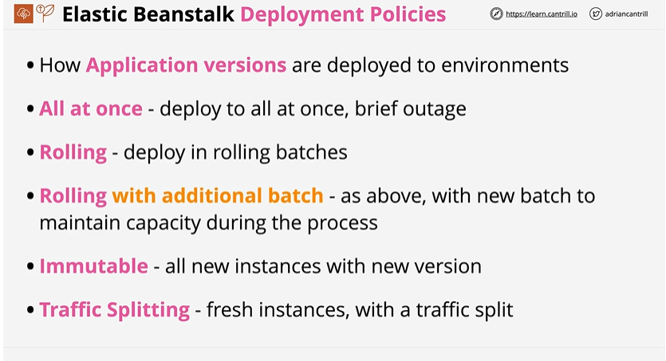
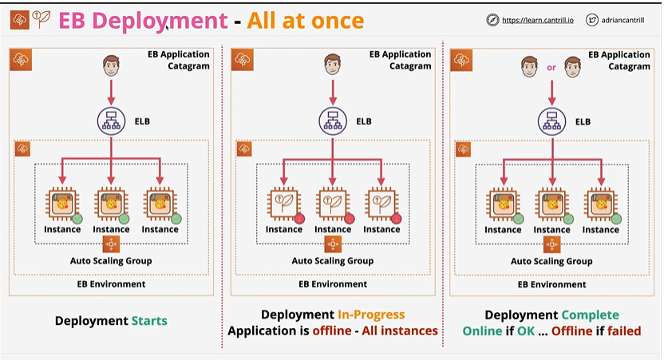
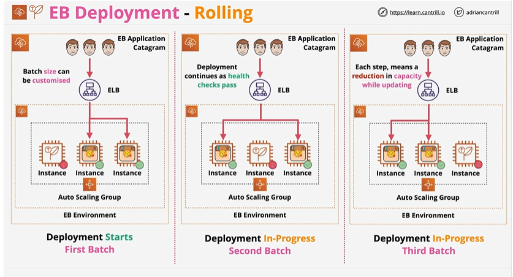
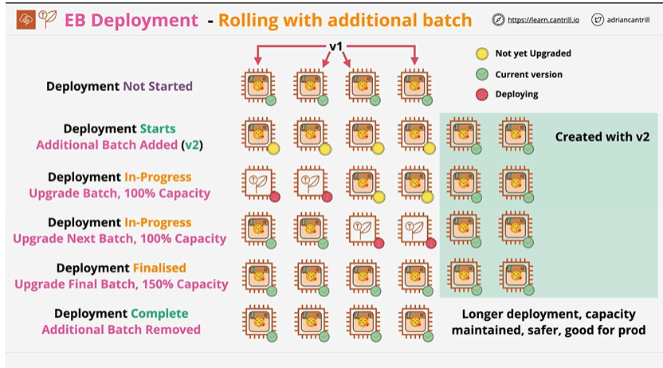
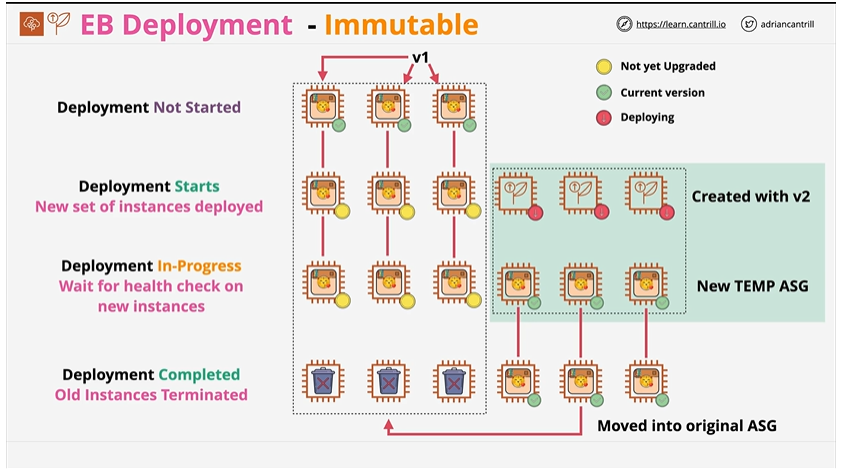
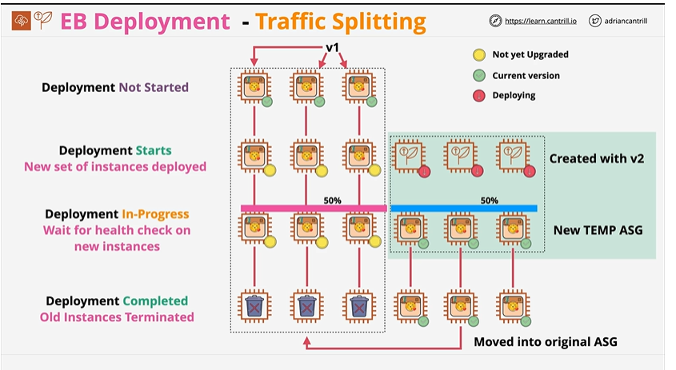
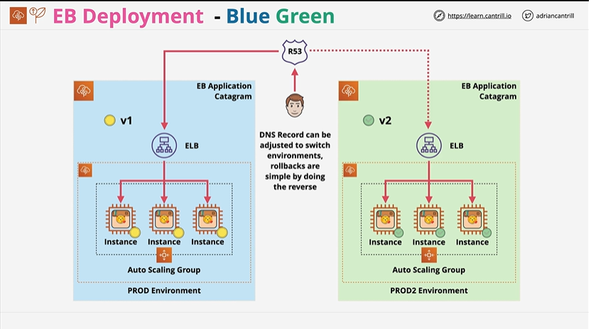

# ⭐ **Elastic Beanstalk – Deployment Policies*

Deployment policies control how **application versions** are rolled out to EB environments
- **All at Once** – deploy to all instances simultaneously; causes a brief outage but is fastest
- **Rolling** – deploy in batches, replacing instances gradually to avoid full downtime
- **Rolling with Additional Batch** – same as rolling, but adds an extra batch to maintain full capacity during deployment
- **Immutable** – creates an entirely new set of instances with the new version, then swaps them in; safest and avoids configuration drift
- **Traffic Splitting** – deploys to a fresh set of instances and shifts a percentage of traffic to them (canary-style testing in EB)

---

- Need to pick batch size in Rolling

- A/B Testing

