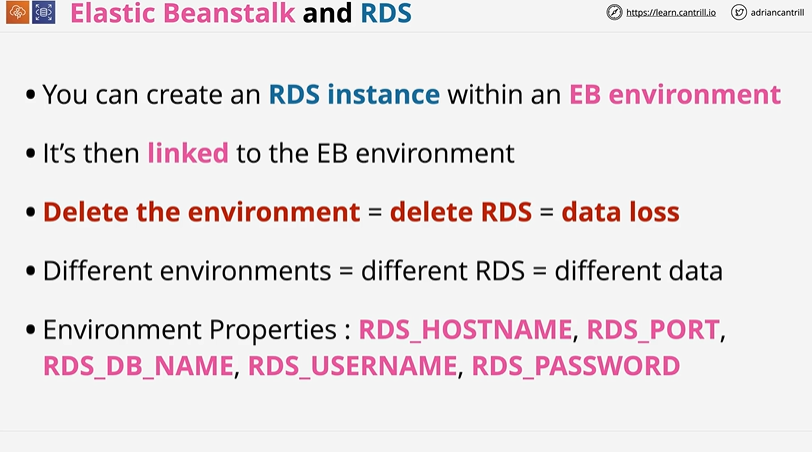
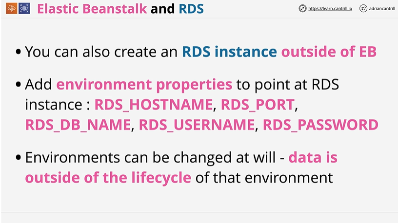
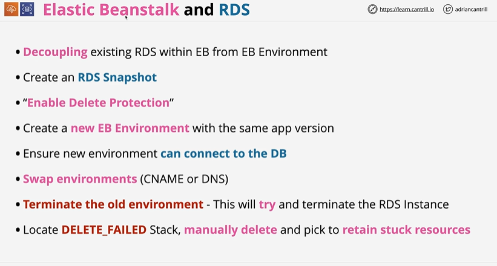

# ⭐ **Elastic Beanstalk and RDS**

- You can create an **RDS instance inside an EB environment**, and it becomes tightly linked to that environment
- Because of this link, **deleting the EB environment also deletes the RDS instance**, resulting in **data loss**
- Each EB environment gets its **own RDS instance**, meaning environments contain **separate databases** with separate data
- Database connection details are exposed to the app via EB environment properties:
**RDS_HOSTNAME, RDS_PORT, RDS_DB_NAME, RDS_USERNAME, RDS_PASSWORD**
- Best practice: **create RDS outside EB** to avoid accidental deletion and allow reuse across environments

---

- You can create an **RDS instance outside of Elastic Beanstalk**, which decouples the database from any EB environment
- Your EB application connects to the external RDS instance using **environment properties** such as:
**RDS_HOSTNAME, RDS_PORT, RDS_DB_NAME, RDS_USERNAME, RDS_PASSWORD**
- Because the RDS instance is external, EB environments can be **recreated, swapped, or deleted without affecting the database**
- Data remains **outside the lifecycle of EB**, ensuring persistence and preventing accidental loss when environments are terminated

---
# ⭐ **Elastic Beanstalk and RDS – Decoupling an Embedded RDS**

- Decoupling means separating an **RDS instance created inside an EB environment** so it no longer gets deleted with the environment
- First, **create an RDS snapshot** to safeguard your data
- Enable **Delete Protection** on the RDS instance to prevent EB from deleting it during environment termination
- Create a **new EB environment** using the same application version but without embedding RDS
- Update environment properties so the new environment **connects to the existing RDS instance**
- Perform an **environment swap** (CNAME or DNS) to reroute production traffic to the new EB environment
- **Terminate the old EB environment** — EB will *attempt* to delete the RDS instance, but delete protection prevents actual deletion
- Locate the **DELETE_FAILED CloudFormation stack**, manually delete it, and choose to **retain stuck resources** (RDS) to complete cleanup

---

