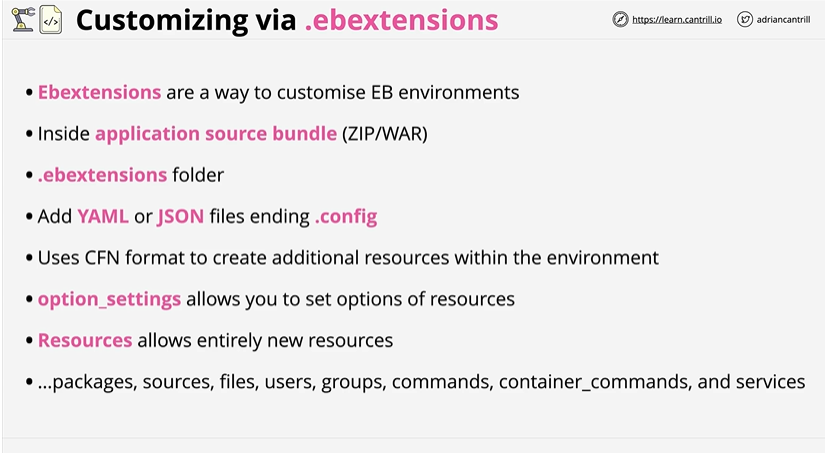

# ⭐ **Elastic Beanstalk – Customizing via .ebextensions**

- **.ebextensions** provide a way to customize and extend Elastic Beanstalk environments beyond the default configuration
- Configuration files live **inside the application source bundle** (ZIP/WAR) under a **.ebextensions** folder
- Files must be **YAML or JSON** and must end with the **.config** extension
- .ebextensions use **CloudFormation-like syntax** to create or configure additional AWS resources within the environment
- **option_settings** allow you to set configuration options for EB-managed resources (EC2, ALB, Auto Scaling, etc.)
- **resources** sections let you define entirely new infrastructure resources for the environment
- You can declare **packages, files, sources, users, groups, commands, container_commands, services**, and more

https://github.com/awsdocs/elastic-beanstalk-samples/tree/main/configuration-files