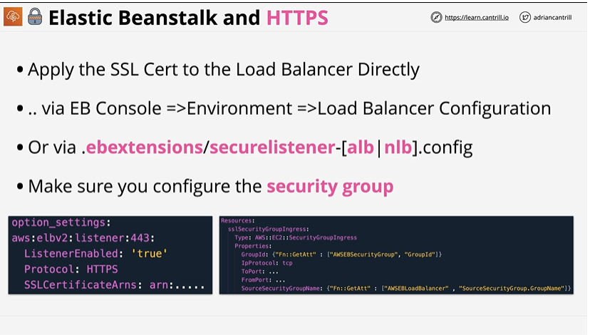

# ⭐ **Elastic Beanstalk and HTTPS (Notes)**

- To enable HTTPS, apply the **SSL certificate directly to the Load Balancer** used by the EB environment
- You can configure HTTPS through the EB Console:
*Environment → Load Balancer → Configuration → Listeners*
- HTTPS can also be configured using **.ebextensions** via a file such as:
`.ebextensions/securelistener-alb.config` or `.ebextensions/securelistener-nlb.config`
- Configuration typically includes `aws:elbv2:listener:443` options, enabling the HTTPS listener and referencing the **SSL certificate ARN**
- Ensure you update the **security groups** so that the load balancer can receive inbound traffic on port **443** and communicate with EC2 instances
- EB uses CloudFormation under the hood, so listener and security group rules can also be created via `.config` files in `.ebextensions`

