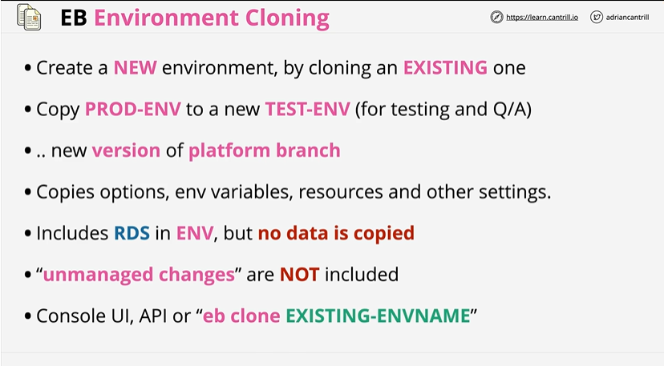

# ⭐ **Elastic Beanstalk – Environment Cloning**

- Cloning creates a **new EB environment** by copying configuration from an **existing environment**`
- Common use case: copy **PROD-ENV** into a **TEST-ENV** for QA, staging, or validation`
- Cloning is also used when adopting a **new platform version** (e.g., new runtime or platform branch)`
- The clone copies **options, environment variables, resources, capacity settings**, and other environment configurations`
- If the original environment contains **RDS attached inside EB**, the RDS *is included as a resource reference*, but **no database data is copied**`
- Any **unmanaged changes** (manual changes made directly to underlying AWS resources outside EB) are **not included** in the clone`
- Cloning can be done from the **AWS Console**, via **API**, or using the EB CLI command:
`eb clone EXISTING-ENVNAME`

---

