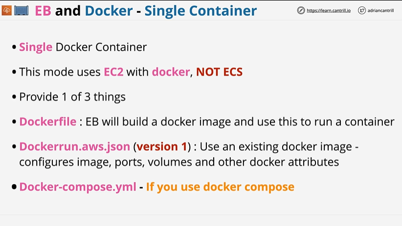
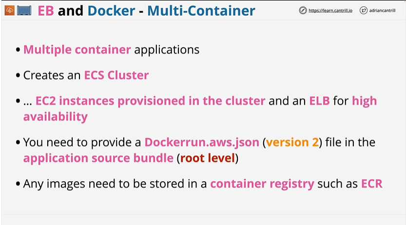
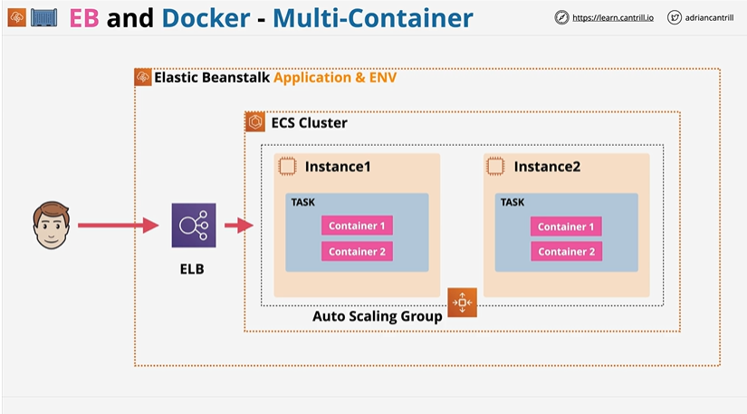

# ⭐ **EB and Docker – Single Container**

- Single Container Docker environments run **one Docker container** per EC2 instance
- This EB mode uses **EC2 with Docker installed**, **not ECS**, even though Docker is involved
- You must provide **one of three** configuration options in your application bundle
- **Dockerfile** – EB builds the Docker image from your Dockerfile and runs it as the container
- **Dockerrun.aws.json (version 1)** – EB pulls and runs an existing Docker image; file defines ports, volumes, and container attributes
- **docker-compose.yml** – used when your application is defined using **Docker Compose** (but still treated as single-container EB mode)
---

# ⭐ **EB and Docker – Multi-Container**

- Supports **multiple-container applications**, unlike the single-container Docker mode
- EB automatically creates an **ECS cluster** under the hood to orchestrate the multiple containers
- EB provisions **EC2 instances in the ECS cluster** and configures an **ELB/ALB** for high availability
- Requires a **Dockerrun.aws.json (version 2)** file placed at the **root level** of the application source bundle
- The v2 Dockerrun file defines: containers, images, ports, volumes, links, and ECS task configuration
- Container images must be stored in a **container registry**, typically **Amazon ECR**, but Docker Hub or others also work
---

# ⭐ **EB and Docker – Multi-Container Architecture**

- Multi-container Docker in Elastic Beanstalk runs an **ECS cluster** inside the EB environment
- Each EC2 instance in the environment runs an **ECS task** that contains multiple containers (e.g., Container 1 + Container 2)
- EB automatically configures an **Auto Scaling Group**, allowing EC2 instances to scale in/out based on demand
- Traffic flows from users → **ELB/ALB** → ECS cluster → containers, ensuring high availability and load balancing
- The entire setup (ECS cluster, tasks, ASG, ELB) is wrapped inside the **Elastic Beanstalk application & environment**, managed by EB
---

